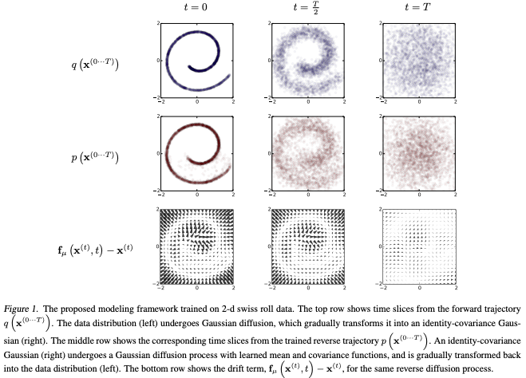
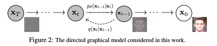
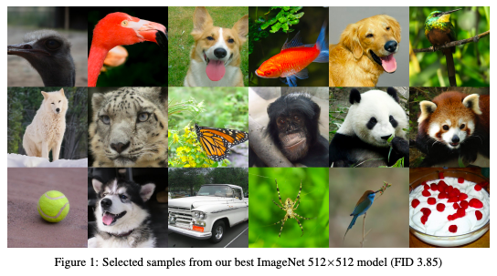

## Deep Unsupervised Learning using Nonequilibrium Thermodynamics
#### Jascha Sohl-Dickstein, Eric A. Weiss, Niru Maheswaranathan, Surya Ganguli
###### 12 Mar 2015 (v1)

  

**Abstract**:
A central problem in machine learning involves modeling complex data-sets using highly flexible families of probability distributions in which learning, sampling, inference, and evaluation are still analytically or computationally tractable. Here, we develop an approach that simultaneously achieves both flexibility and tractability. The essential idea, inspired by non-equilibrium statistical physics, is to systematically and slowly destroy structure in a data distribution through an iterative forward diffusion process. We then learn a reverse diffusion process that restores structure in data, yielding a highly flexible and tractable generative model of the data. This approach allows us to rapidly learn, sample from, and evaluate probabilities in deep generative models with thousands of layers or time steps, as well as to compute conditional and posterior probabilities under the learned model. We additionally release an open source reference implementation of the algorithm.

**Summary**:

The paper proposes an approach to deep unsupervised learning that achieves both flexibility and tractability by systematically destroying structure in a data distribution through an iterative forward diffusion process and learning a reverse diffusion process that restores structure in data.

**Key insights and lessons learned from the paper include**:
* The proposed approach, inspired by non-equilibrium statistical physics, enables the creation of highly flexible and tractable generative models of complex data-sets, allowing for rapid learning, sampling, and evaluation of probabilities in deep generative models with thousands of layers or time steps, as well as the computation of conditional and posterior probabilities under the learned model.
* The proposed approach has potential applications in fields such as computer vision, speech recognition, and natural language processing.
* The authors provide an open source reference implementation of the algorithm, which could facilitate the use of the proposed approach in future research.

**Some questions that could be asked of the authors include**:
* How did the inspiration from non-equilibrium statistical physics come about, and what led you to believe that this approach would be effective for deep unsupervised learning?
* How do the results obtained using your approach compare to those obtained using other deep unsupervised learning methods?
* What are some potential limitations or challenges that could arise when applying this approach to real-world data-sets, and how might these be addressed?
* How might your approach be extended or adapted to address supervised learning tasks, or to incorporate additional types of structure in the generative models?
* Are there any particular data-sets or applications for which you believe your approach would be especially well-suited?

**Some suggestions for related topics or future research directions based on the content of the paper include**:
* Exploring the potential of the proposed approach for addressing other types of machine learning problems beyond unsupervised learning, such as supervised learning or reinforcement learning.
* Investigating the potential of the proposed approach for addressing specific applications or data-sets, such as medical image analysis, financial modeling, or social network analysis.
* Extending the proposed approach to incorporate additional types of structure in the generative models, such as hierarchical structure or long-range dependencies.
* Investigating the potential of combining the proposed approach with other deep learning techniques, such as convolutional neural networks or recurrent neural networks.
* Developing techniques for evaluating the quality of the generative models created using the proposed approach, and comparing the results to those obtained using other methods.

---

## Denoising Diffusion Probabilistic Models
#### Jonathan Ho, Ajay Jain, Pieter Abbeel
###### 19 Jun 2020 (v1)

  

**Abstract**:
We present high quality image synthesis results using diffusion probabilistic models, a class of latent variable models inspired by considerations from nonequilibrium thermodynamics. Our best results are obtained by training on a weighted variational bound designed according to a novel connection between diffusion probabilistic models and denoising score matching with Langevin dynamics, and our models naturally admit a progressive lossy decompression scheme that can be interpreted as a generalization of autoregressive decoding. On the unconditional CIFAR10 dataset, we obtain an Inception score of 9.46 and a state-of-the-art FID score of 3.17. On 256x256 LSUN, we obtain sample quality similar to ProgressiveGAN. Our implementation is available at this https URL

**Summary**:

The paper presents a new class of latent variable models called diffusion probabilistic models for image synthesis, which use a novel weighted variational bound and a progressive lossy decompression scheme that can be seen as a generalization of autoregressive decoding, achieving state-of-the-art results on CIFAR10 and LSUN datasets.

**Key insights and lessons learned from the paper**:
* Diffusion probabilistic models, inspired by nonequilibrium thermodynamics, can be used for image synthesis, achieving high-quality results.
* A novel connection between diffusion probabilistic models and denoising score matching with Langevin dynamics is proposed, and a weighted variational bound is designed based on this connection, resulting in improved image synthesis quality.
* The proposed models admit a progressive lossy decompression scheme that can be interpreted as a generalization of autoregressive decoding, which is computationally efficient and allows for high-resolution image synthesis.

**Questions for the authors**:
* Can diffusion probabilistic models be applied to other types of data, such as audio or text?
* How does the proposed weighted variational bound compare to other variational bounds used in probabilistic models?
* Are there any limitations or challenges in using diffusion probabilistic models for image synthesis that need to be addressed in future research?
* Can the progressive lossy decompression scheme be applied to other types of generative models, such as variational autoencoders?
* How sensitive are the results to the hyperparameters chosen for the model training?

**Suggestions for future research**:
* Investigate the use of diffusion probabilistic models for other applications, such as image inpainting or super-resolution.
* Explore the theoretical properties of diffusion probabilistic models and their connection to other types of probabilistic models.
* Develop new optimization techniques or loss functions to further improve the performance of diffusion probabilistic models.
* Compare the performance of diffusion probabilistic models to other state-of-the-art generative models on a wider range of datasets.
* Investigate the interpretability of diffusion probabilistic models and how they can be used for tasks such as image editing or style transfer.

---

## Diffusion Models Beat GANs on Image Synthesis
#### Prafulla Dhariwal, Alex Nichol
###### 11 May 2021 (v1)

  

**Abstract**:
We show that diffusion models can achieve image sample quality superior to the current state-of-the-art generative models. We achieve this on unconditional image synthesis by finding a better architecture through a series of ablations. For conditional image synthesis, we further improve sample quality with classifier guidance: a simple, compute-efficient method for trading off diversity for fidelity using gradients from a classifier. We achieve an FID of 2.97 on ImageNet 128×128, 4.59 on ImageNet 256×256, and 7.72 on ImageNet 512×512, and we match BigGAN-deep even with as few as 25 forward passes per sample, all while maintaining better coverage of the distribution. Finally, we find that classifier guidance combines well with upsampling diffusion models, further improving FID to 3.94 on ImageNet 256×256 and 3.85 on ImageNet 512×512. We release our code at this https URL

**Summary**:

The paper "Diffusion Models Beat GANs on Image Synthesis" by Prafulla Dhariwal and Alex Nichol shows that diffusion models can outperform GANs in terms of image sample quality by proposing a better architecture and a method for trading off diversity for fidelity using gradients from a classifier.

**Key insights and lessons learned from the paper include**:
* Diffusion models can achieve superior image sample quality compared to current state-of-the-art GANs.
* A better architecture for diffusion models can be obtained through a series of ablations.
* A simple, compute-efficient method called classifier guidance can be used to further improve sample quality in conditional image synthesis.
* Classifier guidance can be combined with upsampling diffusion models to improve sample quality even further.
* The proposed methods achieve state-of-the-art results on ImageNet and maintain better coverage of the distribution.

**Three questions to ask the authors are**:
* What led you to explore diffusion models as an alternative to GANs for image synthesis?
* Can your proposed methods be applied to other types of data besides images?
* Are there any limitations to your proposed methods, and how do you plan to address them in future work?

**Three suggestions for related topics or future research directions based on the paper are**:
* Exploring the use of diffusion models for other types of generative tasks besides image synthesis, such as text generation or speech synthesis.
* Investigating the relationship between the architecture of diffusion models and the quality of generated samples.
* Applying classifier guidance to other types of generative models to improve sample quality.

---
