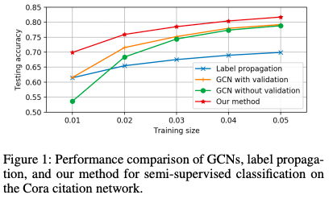
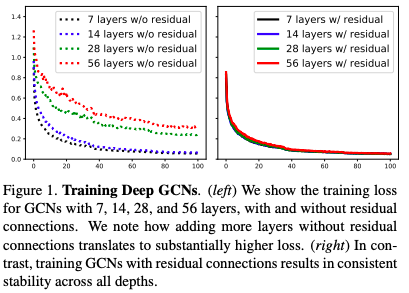
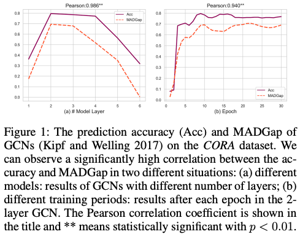
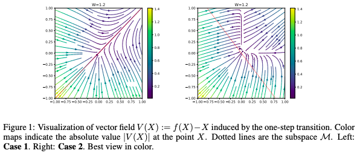
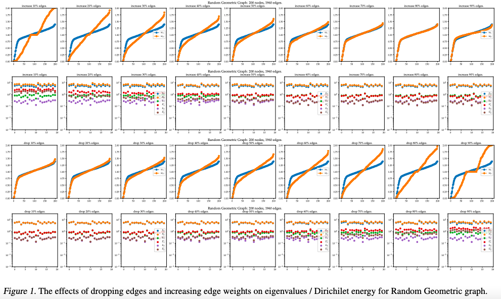
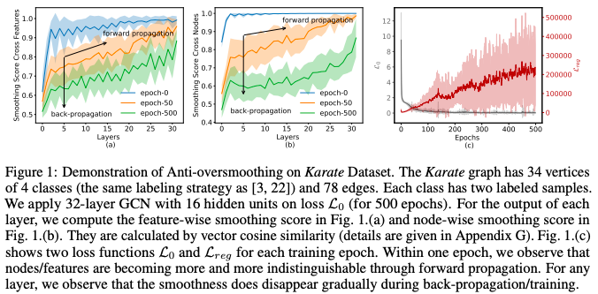
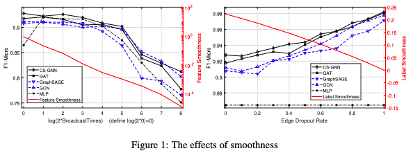
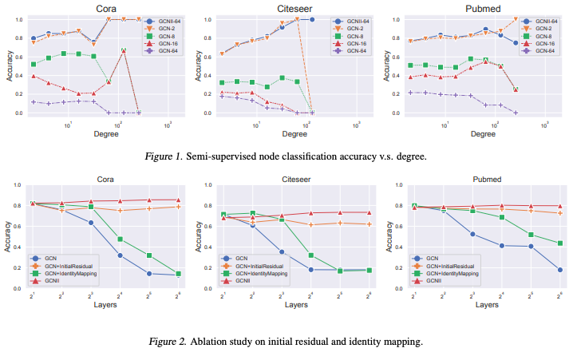
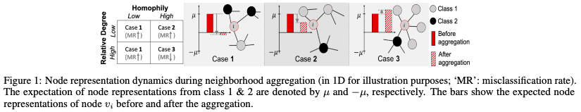
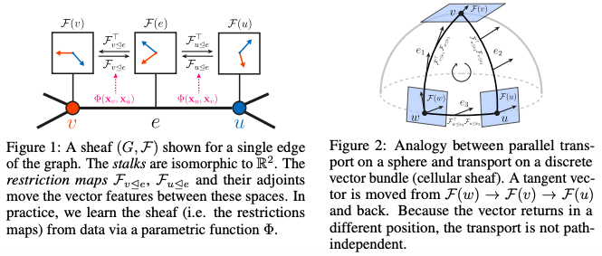

## Deeper Insights into Graph Convolutional Networks for Semi-Supervised Learning
#### Qimai Li, Zhichao Han, Xiao-Ming Wu
###### 22 Jan 2018

  

**Abstract**: 

Many interesting problems in machine learning are being revisited with new deep learning tools. For graph-based semisupervised learning, a recent important development is graph convolutional networks (GCNs), which nicely integrate local vertex features and graph topology in the convolutional layers. Although the GCN model compares favorably with other state-of-the-art methods, its mechanisms are not clear and it still requires a considerable amount of labeled data for validation and model selection. In this paper, we develop deeper insights into the GCN model and address its fundamental limits. First, we show that the graph convolution of the GCN model is actually a special form of Laplacian smoothing, which is the key reason why GCNs work, but it also brings potential concerns of over-smoothing with many convolutional layers. Second, to overcome the limits of the GCN model with shallow architectures, we propose both co-training and self-training approaches to train GCNs. Our approaches significantly improve GCNs in learning with very few labels, and exempt them from requiring additional labels for validation. Extensive experiments on benchmarks have verified our theory and proposals.

**Summary**:

The paper provides deeper insights into Graph Convolutional Networks (GCNs) for semi-supervised learning by demonstrating that graph convolution in GCNs is a special form of Laplacian smoothing, and addressing the limits of shallow GCN architectures with co-training and self-training approaches. The authors show that these approaches significantly improve GCNs in learning with very few labels, and exempt them from requiring additional labels for validation.

**Key insights and lessons learned**:
* The graph convolution in GCNs is a special form of Laplacian smoothing, which is the key to their effectiveness, but also raises concerns of over-smoothing with multiple convolutional layers.
* Shallow GCN architectures have limitations that can be overcome with co-training and self-training approaches.
* These approaches significantly improve GCN performance in learning with very few labels and don't require additional labeled data for validation.

**Questions for the authors**:
* How do the co-training and self-training approaches compare with other state-of-the-art graph-based semi-supervised learning methods?
* Can the proposed methods be applied to other graph-based learning tasks, such as node classification and graph classification?
* What is the computational cost of implementing the co-training and self-training approaches, compared to traditional GCN models?
* How do the performance results change with different graph structures and different numbers of labeled data points?
* What are the potential future directions for improving GCN-based semi-supervised learning?

**Suggestions for related topics or future research directions**:
* Improving the robustness and generalization of GCN-based models.
* Combining GCN-based models with other graph-based learning approaches, such as graph attention networks and random walk-based methods.
* Exploring the application of GCN-based models to real-world problems, such as social network analysis and recommendation systems.
* Studying the interpretability of GCN-based models and developing methods to visualize the learned graph representations.
* Investigating the impact of different graph structures and graph representations on the performance of GCN-based models.

--- 

## DeepGCNs: Can GCNs Go as Deep as CNNs?
#### Guohao Li, Matthias Müller, Ali Thabet, Bernard Ghanem
###### 7 Apr 2019

  

**Abstract**: 

Convolutional Neural Networks (CNNs) achieve impressive performance in a wide variety of fields. Their success benefited from a massive boost when very deep CNN models were able to be reliably trained. Despite their merits, CNNs fail to properly address problems with non-Euclidean data. To overcome this challenge, Graph Convolutional Networks (GCNs) build graphs to represent non-Euclidean data, borrow concepts from CNNs, and apply them in training. GCNs show promising results, but they are usually limited to very shallow models due to the vanishing gradient problem. As a result, most state-of-the-art GCN models are no deeper than 3 or 4 layers. In this work, we present new ways to successfully train very deep GCNs. We do this by borrowing concepts from CNNs, specifically residual/dense connections and dilated convolutions, and adapting them to GCN architectures. Extensive experiments show the positive effect of these deep GCN frameworks. Finally, we use these new concepts to build a very deep 56-layer GCN, and show how it significantly boosts performance (+3.7% mIoU over state-of-the-art) in the task of point cloud semantic segmentation. We believe that the community can greatly benefit from this work, as it opens up many opportunities for advancing GCN-based research.

**Summary**:

The paper "DeepGCNs: Can GCNs Go as Deep as CNNs?" by Li et al. explores the limitations of Graph Convolutional Networks (GCNs) in training deep models, and presents new methods to overcome this challenge. By incorporating concepts from Convolutional Neural Networks (CNNs), such as residual/dense connections and dilated convolutions, the authors successfully train very deep GCNs with 56 layers, achieving improved performance in the task of point cloud semantic segmentation.

**Key insights and lessons learned**:
* GCNs face challenges in training deep models due to the vanishing gradient problem.
* Incorporating concepts from CNNs can help overcome these limitations and lead to deeper GCN models.
* Deep GCNs can achieve improved performance compared to shallow GCN models.

**Questions for the authors**:
* How does the choice of residual/dense connections and dilated convolutions affect the performance of deep GCNs?
* How does the proposed method compare to other methods for addressing the vanishing gradient problem in GCNs?
* Can the proposed method be applied to other tasks and domains beyond point cloud semantic segmentation?

**Future research directions**:
* Exploration of other techniques for addressing the vanishing gradient problem in GCNs.
* Extension of the proposed method to other types of non-Euclidean data beyond point clouds.
* Investigation of the scalability and efficiency of the proposed method for larger and more complex graph structures.

--- 

## Measuring and Relieving the Over-smoothing Problem for Graph Neural Networks from the Topological View
#### Deli Chen, Yankai Lin, Wei Li, Peng Li, Jie Zhou, Xu Sun
###### 7 Sep 2019

  

**Abstract**: 

Graph Neural Networks (GNNs) have achieved promising performance on a wide range of graph-based tasks. Despite their success, one severe limitation of GNNs is the over-smoothing issue (indistinguishable representations of nodes in different classes). In this work, we present a systematic and quantitative study on the over-smoothing issue of GNNs. First, we introduce two quantitative metrics, MAD and MADGap, to measure the smoothness and over-smoothness of the graph nodes representations, respectively. Then, we verify that smoothing is the nature of GNNs and the critical factor leading to over-smoothness is the low information-to-noise ratio of the message received by the nodes, which is partially determined by the graph topology. Finally, we propose two methods to alleviate the over-smoothing issue from the topological view: (1) MADReg which adds a MADGap-based regularizer to the training objective;(2) AdaGraph which optimizes the graph topology based on the model predictions. Extensive experiments on 7 widely-used graph datasets with 10 typical GNN models show that the two proposed methods are effective for relieving the over-smoothing issue, thus improving the performance of various GNN models.

**Summary**:

The paper "Measuring and Relieving the Over-smoothing Problem for Graph Neural Networks from the Topological View" by Deli Chen et al. introduces two metrics to measure the over-smoothing issue in Graph Neural Networks (GNNs) and presents two methods to alleviate this issue by adding a regularizer and optimizing the graph topology. The authors verify that the critical factor causing over-smoothing is the low information-to-noise ratio of the messages received by the nodes, which is partially determined by the graph topology.

**Key insights and lessons learned**:
* Over-smoothing is a limitation of GNNs, where nodes in different classes are indistinguishable.
* The authors introduce two metrics, MAD and MADGap, to measure the smoothness and over-smoothing of the graph node representations, respectively.
* The critical factor causing over-smoothing is the low information-to-noise ratio of the messages received by the nodes, which is partially determined by the graph topology.

**Questions for the authors**:
* How would the proposed methods impact the performance of other types of graph-based models, such as GCN or GraphSAGE?
* What are the computational costs of using the proposed methods, particularly the AdaGraph method?
* How do the proposed methods handle the case where the graph topology is dynamic or changes over time?
* Can the proposed methods be extended to work with different types of graph-based datasets, such as weighted or attributed graphs?
* What is the effect of increasing the size of the training dataset on the performance of the proposed methods?

**Suggestions for future research**:
* Examining the impact of the proposed methods on graph-based tasks in domains other than those used in the experiments.
* Exploring alternative approaches for optimizing the graph topology.
* Evaluating the performance of the proposed methods on large-scale graph datasets.
* Investigating the combination of the proposed methods with other techniques for addressing the over-smoothing issue in GNNs.
* Testing the generalization ability of the proposed methods on unseen graphs.

--- 

## Graph Neural Networks Exponentially Lose Expressive Power for Node Classification
#### Kenta Oono, Taiji Suzuki
###### 27 May 2019

  

**Abstract**: 

Graph Neural Networks (graph NNs) are a promising deep learning approach for analyzing graph-structured data. However, it is known that they do not improve (or sometimes worsen) their predictive performance as we pile up many layers and add non-lineality. To tackle this problem, we investigate the expressive power of graph NNs via their asymptotic behaviors as the layer size tends to infinity. Our strategy is to generalize the forward propagation of a Graph Convolutional Network (GCN), which is a popular graph NN variant, as a specific dynamical system. In the case of a GCN, we show that when its weights satisfy the conditions determined by the spectra of the (augmented) normalized Laplacian, its output exponentially approaches the set of signals that carry information of the connected components and node degrees only for distinguishing nodes. Our theory enables us to relate the expressive power of GCNs with the topological information of the underlying graphs inherent in the graph spectra. To demonstrate this, we characterize the asymptotic behavior of GCNs on the Erdős -- Rényi graph. We show that when the Erdős -- Rényi graph is sufficiently dense and large, a broad range of GCNs on it suffers from the "information loss" in the limit of infinite layers with high probability. Based on the theory, we provide a principled guideline for weight normalization of graph NNs. We experimentally confirm that the proposed weight scaling enhances the predictive performance of GCNs in real data

**Summary**:

The paper "Graph Neural Networks Exponentially Lose Expressive Power for Node Classification" by Kenta Oono and Taiji Suzuki investigates the expressive power of Graph Neural Networks (Graph NNs) and their asymptotic behaviors as the layer size increases. The authors generalize the forward propagation of a Graph Convolutional Network (GCN) as a specific dynamical system and show that when its weights satisfy certain conditions determined by the spectra of the normalized Laplacian, the output of the GCN approaches the set of signals that only carry information of the connected components and node degrees. They also demonstrate this by characterizing the asymptotic behavior of GCNs on the Erdős -- Rényi graph and show that when the graph is dense and large, a broad range of GCNs on it suffers from "information loss" in the limit of infinite layers.

**Key insights and lessons learned**:
* Graph NNs are a promising deep learning approach for analyzing graph-structured data, but their predictive performance can decrease as the number of layers increases.
* The expressive power of Graph NNs can be related to the topological information of the underlying graphs inherent in the graph spectra.
* The asymptotic behavior of GCNs on the Erdős -- Rényi graph shows that when the graph is dense and large, a broad range of GCNs on it suffers from "information loss" in the limit of infinite layers.

**Questions for the authors**:
* What is the significance of the conditions determined by the spectra of the normalized Laplacian in determining the expressive power of GCNs?
* Can you explain the concept of "information loss" and why it occurs in GCNs on the Erdős -- Rényi graph when the graph is dense and large?
* How can the findings of this paper be applied in practical applications of Graph NNs?
* Are there any other graph models or types of data where the findings of this paper can be applied?
* Can the theory developed in this paper be extended to other Graph NN variants besides GCN?

**Future research directions**:
* Exploring the impact of different graph models on the expressive power of Graph NNs.
* Investigating the use of other graph spectra besides the normalized Laplacian in determining the expressive power of Graph NNs.
* Developing methods to overcome the "information loss" problem in GCNs and other Graph NN variants.
* Applying the theory developed in this paper to other types of graph-structured data besides node classification.
* Examining the relationship between the expressive power of Graph NNs and their generalization performance.

--- 

## A Note on Over-Smoothing for Graph Neural Networks
#### Chen Cai, Yusu Wang
###### 23 Jun 2020

  

**Abstract**: 

Graph Neural Networks (GNNs) have achieved a lot of success on graph-structured data. However, it is observed that the performance of graph neural networks does not improve as the number of layers increases. This effect, known as over-smoothing, has been analyzed mostly in linear cases. In this paper, we build upon previous results \cite{oono2019graph} to further analyze the over-smoothing effect in the general graph neural network architecture. We show when the weight matrix satisfies the conditions determined by the spectrum of augmented normalized Laplacian, the Dirichlet energy of embeddings will converge to zero, resulting in the loss of discriminative power. Using Dirichlet energy to measure "expressiveness" of embedding is conceptually clean; it leads to simpler proofs than \cite{oono2019graph} and can handle more non-linearities.

**Summary**:
The paper "A Note on Over-Smoothing for Graph Neural Networks" by Chen Cai and Yusu Wang analyzes the over-smoothing effect in Graph Neural Networks (GNNs), where the performance of GNNs does not improve with increasing number of layers. The authors show that when the weight matrix of GNNs satisfies certain conditions, the Dirichlet energy of the embeddings will converge to zero, leading to the loss of discriminative power. The authors use Dirichlet energy to measure the "expressiveness" of the embeddings, which leads to a simpler proof than previous results and can handle more non-linearities.

**Key insights and lessons**:
* Over-smoothing in GNNs is a well-known phenomenon, where the performance of GNNs does not improve with increasing number of layers.
* The authors show that over-smoothing occurs when the weight matrix of GNNs satisfies certain conditions determined by the spectrum of the augmented normalized Laplacian.
* The authors use Dirichlet energy to measure the "expressiveness" of the embeddings and prove that it converges to zero when over-smoothing occurs, leading to the loss of discriminative power.

**Questions for the authors**:
* Can you explain why the use of Dirichlet energy as a measure of "expressiveness" of embeddings is conceptually clean?
* Can you give more examples of non-linearities that your method can handle?
* Can you explain how the results of this paper can be applied to other types of graph-structured data, such as attributed graphs?
* Can you discuss the limitations of your method and how it can be improved in future work?
* Can you provide a comparison between the results of this paper and previous results on over-smoothing in GNNs?

**Suggested future research directions**:
* The application of the results of this paper to other types of graph-structured data, such as attributed graphs and dynamic graphs.
* The development of new methods to prevent over-smoothing in GNNs, such as early stopping and dropout.
* The exploration of different measures of "expressiveness" of embeddings and their impact on over-smoothing.
* The comparison of the results of this paper with other graph representation learning methods, such as graph convolutional networks and graph autoencoders.
* The investigation of the scalability and efficiency of the methods proposed in this paper for large-scale graph-structured data.

--- 

## Revisiting Over-smoothing in Deep GCNs
#### Chaoqi Yang, Ruijie Wang, Shuochao Yao, Shengzhong Liu, Tarek Abdelzaher
###### 30 Mar 2020

  

**Abstract**: 

Oversmoothing has been assumed to be the major cause of performance drop in deep graph convolutional networks (GCNs). In this paper, we propose a new view that deep GCNs can actually learn to anti-oversmooth during training. This work interprets a standard GCN architecture as layerwise integration of a Multi-layer Perceptron (MLP) and graph regularization. We analyze and conclude that before training, the final representation of a deep GCN does over-smooth, however, it learns anti-oversmoothing during training. Based on the conclusion, the paper further designs a cheap but effective trick to improve GCN training. We verify our conclusions and evaluate the trick on three citation networks and further provide insights on neighborhood aggregation in GCNs.

**Summary**:

The paper "Revisiting Over-smoothing in Deep GCNs" by Chaoqi Yang et al. presents a new view on the problem of over-smoothing in deep graph convolutional networks (GCNs), proposing that deep GCNs can actually learn to anti-oversmooth during training.

**Key Insights and Lessons Learned**:
* The authors interpret a standard GCN architecture as a layerwise integration of a Multi-layer Perceptron (MLP) and graph regularization.
* They conclude that before training, the final representation of a deep GCN over-smooths, but that it learns anti-oversmoothing during training.
* The authors design a cheap but effective trick to improve GCN training, and verify their conclusions and evaluate the trick on three citation networks.

**Questions for the Authors**:
* Can you provide more details on the cheap but effective trick that was designed to improve GCN training?
* How generalizable is the conclusion that deep GCNs can learn to anti-oversmooth during training to other types of graph data?
* Could you discuss the potential implications of the conclusion on neighborhood aggregation in GCNs for the wider field of graph convolutional networks?

**Suggestions for Future Research**:
* Further exploration into the potential generalization of the conclusion to other types of graph data.
* Extension of the cheap but effective trick to other types of graph convolutional networks.
* Comparison of the trick to other existing techniques for addressing over-smoothing in GCNs.
* Examination of the potential implications of the conclusion for other graph deep learning tasks.

--- 
## Measuring and Improving the Use of Graph Information in Graph Neural Networks
#### Yifan Hou, Jian Zhang, James Cheng, Kaili Ma, Richard T. B. Ma, Hongzhi Chen, Ming-Chang Yang
###### 27 Jun 2022

  

**Abstract**: 

Graph neural networks (GNNs) have been widely used for representation learning on graph data. However, there is limited understanding on how much performance GNNs actually gain from graph data. This paper introduces a context-surrounding GNN framework and proposes two smoothness metrics to measure the quantity and quality of information obtained from graph data. A new GNN model, called CS-GNN, is then designed to improve the use of graph information based on the smoothness values of a graph. CS-GNN is shown to achieve better performance than existing methods in different types of real graphs.

**Summary**:

The paper "Measuring and Improving the Use of Graph Information in Graph Neural Networks" by Yifan Hou, Jian Zhang, James Cheng, Kaili Ma, Richard T. B. Ma, Hongzhi Chen, and Ming-Chang Yang introduces a new graph neural network (GNN) framework, CS-GNN, that measures and improves the use of graph information in GNNs. The authors propose two smoothness metrics to evaluate the quantity and quality of information obtained from graph data, and demonstrate that CS-GNN outperforms existing methods on various real graphs.

**Key insights and lessons learned**:
* The authors introduce two smoothness metrics to evaluate the use of graph information in GNNs.
* The proposed CS-GNN framework is designed to improve the use of graph information based on the smoothness values of a graph.
* CS-GNN shows improved performance compared to existing methods on different types of real graphs.

**Questions for the authors**:
* Can the smoothness metrics be extended to other graph representation learning methods besides GNNs?
* How does the CS-GNN framework compare to other approaches for improving the use of graph information in GNNs?
* Can the CS-GNN framework be extended to handle graphs with different types of node and edge features?
* How does the performance of CS-GNN change with increasing graph size and complexity?
* Can the CS-GNN framework be applied to other graph learning tasks besides representation learning?

**Suggestions for related topics or future research directions**:
* Extension of the CS-GNN framework to handle graphs with dynamic structure and temporal information.
* Application of the CS-GNN framework to graph-based semi-supervised and unsupervised learning tasks.
* Integration of attention mechanisms and graph convolutions in the CS-GNN framework.
* Investigation of the relationship between smoothness metrics and graph data distributions.
* Comparison of the CS-GNN framework with other graph representation learning methods, such as graph auto-encoders and graph attention networks.

--- 

## Simple and Deep Graph Convolutional Networks
#### Ming Chen, Zhewei Wei, Zengfeng Huang, Bolin Ding, Yaliang Li
###### 4 Jul 2020

  

**Abstract**: 

Graph convolutional networks (GCNs) are a powerful deep learning approach for graph-structured data. Recently, GCNs and subsequent variants have shown superior performance in various application areas on real-world datasets. Despite their success, most of the current GCN models are shallow, due to the {\em over-smoothing} problem. In this paper, we study the problem of designing and analyzing deep graph convolutional networks. We propose the GCNII, an extension of the vanilla GCN model with two simple yet effective techniques: {\em Initial residual} and {\em Identity mapping}. We provide theoretical and empirical evidence that the two techniques effectively relieves the problem of over-smoothing. Our experiments show that the deep GCNII model outperforms the state-of-the-art methods on various semi- and full-supervised tasks

**Summary**:

The paper "Simple and Deep Graph Convolutional Networks" by Ming Chen, Zhewei Wei, Zengfeng Huang, Bolin Ding, and Yaliang Li focuses on designing and analyzing deep graph convolutional networks (GCNs) to overcome the over-smoothing problem in GCN models. The authors propose the GCNII, an extension of the vanilla GCN model that uses two simple yet effective techniques called Initial residual and Identity mapping to relieve over-smoothing. The paper provides theoretical and empirical evidence for the effectiveness of GCNII and shows that it outperforms state-of-the-art methods on various semi- and full-supervised tasks.

**Key Insights and Lessons Learned**:
* Over-smoothing is a problem in shallow GCN models.
* The GCNII model effectively relieves over-smoothing by using two simple techniques: Initial residual and Identity mapping.
* The GCNII model outperforms the state-of-the-art methods on various semi- and full-supervised tasks.

**Questions to ask the authors**:
* Can you explain the intuition behind the Initial residual and Identity mapping techniques?
* How did you select the datasets and tasks used in the experiments?
* Have you tested the GCNII model on other graph-structured data besides the ones used in the experiments?
* Can the GCNII model be extended to handle graph-structured data with varying node features?
* How does the GCNII model compare to other deep learning approaches for graph-structured data?

**Suggestions for future research**:
* Evaluate the performance of the GCNII model on graph-structured data with varying node features.
* Explore the scalability of the GCNII model on large graph-structured data.
* Investigate the impact of different activation functions on the performance of the GCNII model.
* Study the effect of different loss functions on the GCNII model.
* Compare the GCNII model to other deep learning approaches for graph-structured data with attention mechanisms.

--- 

## Two Sides of the Same Coin: Heterophily and Oversmoothing in Graph Convolutional Neural Networks
#### Yujun Yan, Milad Hashemi, Kevin Swersky, Yaoqing Yang, Danai Koutra
###### 12 Feb 2021

  

**Abstract**:
In node classification tasks, graph convolutional neural networks (GCNs) have demonstrated competitive performance over traditional methods on diverse graph data. However, it is known that the performance of GCNs degrades with increasing number of layers (oversmoothing problem) and recent studies have also shown that GCNs may perform worse in heterophilous graphs, where neighboring nodes tend to belong to different classes (heterophily problem). These two problems are usually viewed as unrelated, and thus are studied independently, often at the graph filter level from a spectral perspective.
We are the first to take a unified perspective to jointly explain the oversmoothing and heterophily problems at the node level. Specifically, we profile the nodes via two quantitative metrics: the relative degree of a node (compared to its neighbors) and the node-level heterophily. Our theory shows that the interplay of these two profiling metrics defines three cases of node behaviors, which explain the oversmoothing and heterophily problems jointly and can predict the performance of GCNs. Based on insights from our theory, we show theoretically and empirically the effectiveness of two strategies: structure-based edge correction, which learns corrected edge weights from structural properties (i.e., degrees), and feature-based edge correction, which learns signed edge weights from node features. Compared to other approaches, which tend to handle well either heterophily or oversmoothing, we show that {our model, GGCN}, which incorporates the two strategies performs well in both problems.

**Summary**:
The paper "Two Sides of the Same Coin: Heterophily and Oversmoothing in Graph Convolutional Neural Networks" by Yan et al. presents a unified perspective on the oversmoothing and heterophily problems in graph convolutional neural networks (GCNs) for node classification tasks. The authors profile nodes in the graph data based on two metrics, the relative degree and node-level heterophily, and show how the interplay of these two metrics leads to three cases of node behaviors that explain the oversmoothing and heterophily problems. The authors also present two strategies that improve the performance of GCNs and demonstrate their effectiveness theoretically and empirically.

**Key insights and lessons**:
* The oversmoothing and heterophily problems in GCNs are interrelated.
* The performance of GCNs can be predicted based on the relative degree and node-level heterophily of nodes in the graph.
* Two strategies, structure-based edge sampling and normalization-based node sampling, can effectively improve the performance of GCNs.

**Questions for the authors**:
* Can you explain why you chose the relative degree and node-level heterophily as the two metrics to profile nodes in the graph data?
* How do you see the interplay of the relative degree and node-level heterophily affecting the performance of GCNs in real-world applications?
* Can you discuss the limitations of the strategies presented in the paper for addressing the oversmoothing and heterophily problems in GCNs?
* How can these strategies be extended to other types of graph-structured data?
* Can you compare the performance of GCNs with the two strategies presented in the paper to other state-of-the-art node classification methods on graph-structured data?

**Future research directions**:
* Investigating the applicability of these strategies for other graph learning tasks, such as link prediction and graph classification.
* Exploring the use of deep graph networks in combination with the strategies presented in the paper to improve performance.
* Evaluating the performance of GCNs with the strategies presented in the paper on larger, more complex graph-structured data.
* Developing methods to extend the strategies presented in the paper to handle graph data with more diverse node profiles.
* Investigating the interpretability of GCNs with the strategies presented in the paper and how they can be used for graph-structured data analysis.

--- 

## Neural Sheaf Diffusion: A Topological Perspective on Heterophily and Oversmoothing in GNNs
#### Cristian Bodnar, Francesco Di Giovanni, Benjamin Paul Chamberlain, Pietro Liò, Michael M. Bronstein
###### 9 Feb 2022 (v1)

  

**Abstract**:
Cellular sheaves equip graphs with a "geometrical" structure by assigning vector spaces and linear maps to nodes and edges. Graph Neural Networks (GNNs) implicitly assume a graph with a trivial underlying sheaf. This choice is reflected in the structure of the graph Laplacian operator, the properties of the associated diffusion equation, and the characteristics of the convolutional models that discretise this equation. In this paper, we use cellular sheaf theory to show that the underlying geometry of the graph is deeply linked with the performance of GNNs in heterophilic settings and their oversmoothing behaviour. By considering a hierarchy of increasingly general sheaves, we study how the ability of the sheaf diffusion process to achieve linear separation of the classes in the infinite time limit expands. At the same time, we prove that when the sheaf is non-trivial, discretised parametric diffusion processes have greater control than GNNs over their asymptotic behaviour. On the practical side, we study how sheaves can be learned from data. The resulting sheaf diffusion models have many desirable properties that address the limitations of classical graph diffusion equations (and corresponding GNN models) and obtain competitive results in heterophilic settings. Overall, our work provides new connections between GNNs and algebraic topology and would be of interest to both fields.

**Summary**:

The paper "Neural Sheaf Diffusion: A Topological Perspective on Heterophily and Oversmoothing in GNNs" by Bodnar et al. explores the connection between the underlying geometry of a graph and the performance of Graph Neural Networks (GNNs) using cellular sheaf theory. The authors show that the choice of sheaf influences the properties of the graph Laplacian operator and the characteristics of the convolutional models used in GNNs, affecting their performance in heterophilic settings and oversmoothing behavior. They also study the learning of sheaves from data and propose sheaf diffusion models that address the limitations of classical graph diffusion equations.

**Key Insights and Lessons Learned**:
* The choice of underlying sheaf has a significant impact on the properties of GNNs
* The ability of the sheaf diffusion process to achieve linear separation of classes expands with a hierarchy of increasingly general sheaves
* Discretized parametric diffusion processes have greater control over their asymptotic behavior than GNNs when the sheaf is non-trivial
* Sheaf diffusion models have desirable properties that address the limitations of classical graph diffusion equations

**Questions for the authors**:
* How do the sheaf diffusion models compare to existing GNNs in terms of computational complexity and scalability?
* Can the sheaf diffusion models be used for graph classification tasks with a large number of classes?
* What are some applications of sheaf diffusion models beyond graph-based problems?
* How do the learned sheaves change when the graph structure is updated over time?
* Are there any limitations to the use of sheaf diffusion models, and how can they be addressed in future work?

**Suggestions for related topics or future research directions**:
* Extension of the sheaf diffusion models to dynamic graphs and temporal networks
* Combining sheaf diffusion models with other graph-based deep learning techniques such as graph attention networks
* Application of sheaf diffusion models to graph-based reinforcement learning problems
* Comparison of sheaf diffusion models with other graph convolutional networks on real-world datasets
* Investigation of the use of sheaf diffusion models for graph representation learning and graph visualization.

--- 
