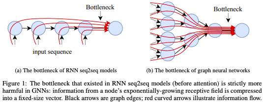
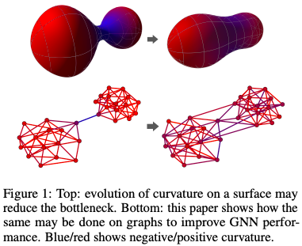

## On the Bottleneck of Graph Neural Networks and its Practical Implications
#### Uri Alon, Eran Yahav
###### 9 Jun 2020

  

**Abstract**: 

Since the proposal of the graph neural network (GNN) by Gori et al. (2005) and Scarselli et al. (2008), one of the major problems in training GNNs was their struggle to propagate information between distant nodes in the graph. We propose a new explanation for this problem: GNNs are susceptible to a bottleneck when aggregating messages across a long path. This bottleneck causes the over-squashing of exponentially growing information into fixed-size vectors. As a result, GNNs fail to propagate messages originating from distant nodes and perform poorly when the prediction task depends on long-range interaction. In this paper, we highlight the inherent problem of over-squashing in GNNs: we demonstrate that the bottleneck hinders popular GNNs from fitting long-range signals in the training data; we further show that GNNs that absorb incoming edges equally, such as GCN and GIN, are more susceptible to over-squashing than GAT and GGNN; finally, we show that prior work, which extensively tuned GNN models of long-range problems, suffers from over-squashing, and that breaking the bottleneck improves their state-of-the-art results without any tuning or additional weights.

**Summary**:

The paper "On the Bottleneck of Graph Neural Networks and its Practical Implications" by Uri Alon and Eran Yahav focuses on the problem of over-squashing in graph neural networks (GNNs) which hinders them from fitting long-range signals in training data, and explains that this is due to a bottleneck when aggregating messages across a long path in the graph.

**Key insights and lessons learned**:
* GNNs struggle to propagate information between distant nodes in a graph, due to a bottleneck when aggregating messages across a long path.
* Over-squashing in GNNs causes the over-squashing of exponentially growing information into fixed-size vectors.
* The bottleneck in GNNs hinders popular models like GCN and GIN from fitting long-range signals in training data, but GAT and GGNN are less susceptible to over-squashing.
* Breaking the bottleneck in GNNs improves their results on long-range problems without any tuning or additional weights.

**Questions for the authors**:
* Can you provide more insight into the process of breaking the bottleneck in GNNs?
* Have you explored how the choice of graph structure affects the over-squashing bottleneck?
* Can you discuss the limitations of the proposed solution and its potential impact on other graph-based models?
* How does the proposed solution compare to other methods for addressing the information propagation problem in GNNs?
* Are there any applications of the proposed solution outside of graph classification and regression problems?

**Suggestions for related topics or future research directions**:
* Extending the solution to other types of graph-based models.
* Exploring the impact of the bottleneck on performance in other graph-based tasks, such as graph clustering and link prediction.
* Investigating the robustness of the solution to graph perturbations, such as edge deletion and node removal.
* Integrating the solution with other techniques for addressing the limitations of GNNs, such as graph pooling and attention mechanisms.
* Evaluating the scalability of the solution to larger and more complex graphs.

--- 

## Understanding over-squashing and bottlenecks on graphs via curvature
#### Jake Topping, Francesco Di Giovanni, Benjamin Paul Chamberlain, Xiaowen Dong, Michael M. Bronstein
###### 29 Nov 2021

  

**Abstract**: 

Most graph neural networks (GNNs) use the message passing paradigm, in which node features are propagated on the input graph. Recent works pointed to the distortion of information flowing from distant nodes as a factor limiting the efficiency of message passing for tasks relying on long-distance interactions. This phenomenon, referred to as 'over-squashing', has been heuristically attributed to graph bottlenecks where the number of k-hop neighbors grows rapidly with k. We provide a precise description of the over-squashing phenomenon in GNNs and analyze how it arises from bottlenecks in the graph. For this purpose, we introduce a new edge-based combinatorial curvature and prove that negatively curved edges are responsible for the over-squashing issue. We also propose and experimentally test a curvature-based graph rewiring method to alleviate the over-squashing.

**Summary**:

The paper by Topping et al. provides a precise description of the over-squashing phenomenon in graph neural networks (GNNs) and analyzes how it arises from bottlenecks in the graph. The authors introduce a new edge-based combinatorial curvature and prove that negatively curved edges are responsible for the over-squashing issue. They also propose and experimentally test a curvature-based graph rewiring method to alleviate the over-squashing.

**Key insights and lessons learned**:
* Over-squashing in GNNs is a phenomenon that limits the efficiency of message passing for tasks relying on long-distance interactions.
* Negatively curved edges are responsible for the over-squashing issue.
* A curvature-based graph rewiring method can alleviate the over-squashing.

**Questions for the authors**:
* Can the curvature-based graph rewiring method be applied to other types of graphs beyond the ones used in the experiments?
* How does the curvature-based graph rewiring method compare to other graph rewiring methods in terms of efficiency and accuracy?
* How robust is the curvature-based graph rewiring method to changes in the graph structure?

**Suggestions for future research directions**:
* Evaluating the effectiveness of the curvature-based graph rewiring method on a wider range of graph types and tasks.
* Exploring the connection between curvature and other graph properties, such as centrality and community structure.
* Developing new methods for automatically detecting and alleviating bottlenecks in graphs.

--- 

