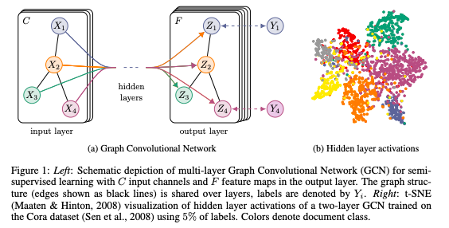
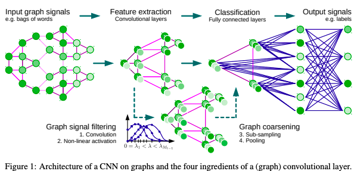
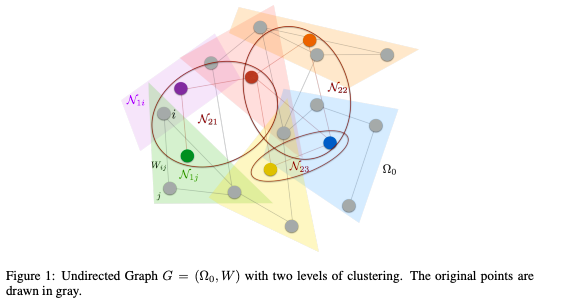
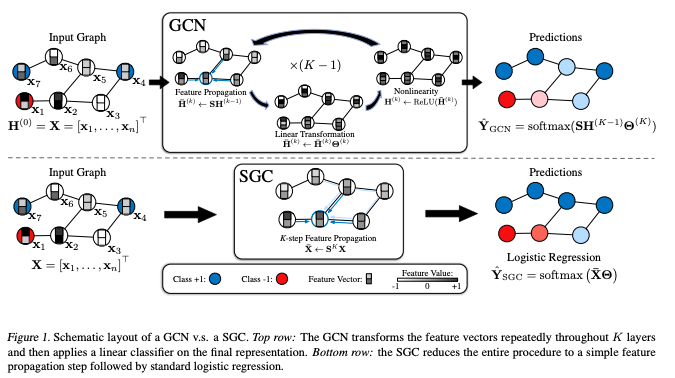

## Semi-Supervised Classification with Graph Convolutional Networks
#### Thomas N. Kipf, Max Welling
###### 9 Sep 2016 (v1)

  

**Abstract**:
We present a scalable approach for semi-supervised learning on graph-structured data that is based on an efficient variant of convolutional neural networks which operate directly on graphs. We motivate the choice of our convolutional architecture via a localized first-order approximation of spectral graph convolutions. Our model scales linearly in the number of graph edges and learns hidden layer representations that encode both local graph structure and features of nodes. In a number of experiments on citation networks and on a knowledge graph dataset we demonstrate that our approach outperforms related methods by a significant margin.

**Summary**:

The paper presents a method for semi-supervised learning on graph-structured data using an efficient variant of convolutional neural networks that operate directly on graphs, which is demonstrated to outperform related methods by a significant margin on citation networks and a knowledge graph dataset.

**Key insights and lessons learned**:
* Graph Convolutional Networks (GCNs) can be used for semi-supervised learning on graph-structured data by using an efficient variant of convolutional neural networks that operate directly on graphs.
* The choice of convolutional architecture is motivated by a localized first-order approximation of spectral graph convolutions.
* The model scales linearly in the number of graph edges and learns hidden layer representations that encode both local graph structure and features of nodes.
* The proposed approach outperforms related methods by a significant margin on citation networks and a knowledge graph dataset.

**Questions for the authors**:
* Can your approach be applied to other types of graph-structured data, such as social networks or biological networks?
* What are some limitations or challenges of your approach that future research should address?
* How sensitive is your approach to the amount of labeled data, and how can it be adapted for scenarios with very few labeled examples?
* How would you compare the performance of your approach to traditional machine learning methods, such as decision trees or SVMs, on graph-structured data?
* How would you recommend practitioners choose hyperparameters for your model, such as the number of layers or hidden units?

**Suggestions for future research**:
* Investigate how GCNs can be applied to other types of graph-structured data, such as social networks, biological networks, or financial networks.
* Explore how GCNs can be combined with other machine learning models, such as reinforcement learning or adversarial learning, for more complex tasks.
* Develop techniques to interpret the representations learned by GCNs, especially in scenarios where there are many layers or hidden units.
* Examine how GCNs can be adapted for scenarios with very few labeled examples, such as few-shot learning or one-shot learning.
* Investigate the scalability of GCNs to even larger graphs, and how they can be applied to distributed or streaming data.

---

## Convolutional Neural Networks on Graphs with Fast Localized Spectral Filtering
#### Michaël Defferrard, Xavier Bresson, Pierre Vandergheynst
###### 30 Jun 2016 (v1)

  

**Abstract**:
In this work, we are interested in generalizing convolutional neural networks (CNNs) from low-dimensional regular grids, where image, video and speech are represented, to high-dimensional irregular domains, such as social networks, brain connectomes or words' embedding, represented by graphs. We present a formulation of CNNs in the context of spectral graph theory, which provides the necessary mathematical background and efficient numerical schemes to design fast localized convolutional filters on graphs. Importantly, the proposed technique offers the same linear computational complexity and constant learning complexity as classical CNNs, while being universal to any graph structure. Experiments on MNIST and 20NEWS demonstrate the ability of this novel deep learning system to learn local, stationary, and compositional features on graphs.

**Summary**:

The paper "Convolutional Neural Networks on Graphs with Fast Localized Spectral Filtering" presents a formulation of convolutional neural networks (CNNs) on graphs using spectral graph theory, which allows for efficient numerical schemes to design fast localized convolutional filters on graphs with the same linear computational complexity and constant learning complexity as classical CNNs, while being universal to any graph structure. The proposed technique is demonstrated to be able to learn local, stationary, and compositional features on graphs through experiments on MNIST and 20NEWS datasets.

**Key insights and lessons learned**:
* CNNs on graphs can be formulated using spectral graph theory, which provides the necessary mathematical background and efficient numerical schemes to design fast localized convolutional filters on graphs.
* The proposed technique offers the same linear computational complexity and constant learning complexity as classical CNNs, while being universal to any graph structure.
* The proposed deep learning system can learn local, stationary, and compositional features on graphs, as demonstrated through experiments on MNIST and 20NEWS datasets.

**Questions for the authors**:
* What inspired you to investigate CNNs on graphs, and what challenges did you face in this research?
* How does the proposed technique compare to other methods for learning on graphs, such as graph neural networks?
* Can the proposed technique be extended to handle directed or weighted graphs?
* What are some potential applications of CNNs on graphs beyond the ones you have demonstrated in this paper?
* What are some limitations of the proposed technique, and how might they be addressed in future research?

**Future research directions**:
* Investigation of the use of CNNs on graphs for a wider range of applications and datasets.
* Exploration of techniques for combining CNNs on graphs with other types of neural networks or deep learning architectures.
* Investigation of the use of CNNs on graphs for semi-supervised or unsupervised learning tasks.
* Extension of the proposed technique to handle directed or weighted graphs.
* Investigation of the limitations of the proposed technique and development of techniques to address these limitations.

---

## Spectral Networks and Locally Connected Networks on Graphs
#### Joan Bruna, Wojciech Zaremba, Arthur Szlam, Yann LeCun
###### 21 Dec 2013 (v1)

  

**Abstract**:
Convolutional Neural Networks are extremely efficient architectures in image and audio recognition tasks, thanks to their ability to exploit the local translational invariance of signal classes over their domain. In this paper we consider possible generalizations of CNNs to signals defined on more general domains without the action of a translation group. In particular, we propose two constructions, one based upon a hierarchical clustering of the domain, and another based on the spectrum of the graph Laplacian. We show through experiments that for low-dimensional graphs it is possible to learn convolutional layers with a number of parameters independent of the input size, resulting in efficient deep architectures.

**Summary**:

The paper proposes two generalizations of Convolutional Neural Networks (CNNs) to signals defined on more general domains without the action of a translation group: one based on a hierarchical clustering of the domain and the other on the spectrum of the graph Laplacian, and shows through experiments that for low-dimensional graphs, it is possible to learn convolutional layers with a number of parameters independent of the input size, resulting in efficient deep architectures.

**Key insights and lessons learned from the paper**:
* CNNs are highly efficient architectures in image and audio recognition tasks due to their ability to exploit the local translational invariance of signal classes over their domain.
* CNNs can be generalized to signals defined on more general domains without the action of a translation group.
* Two possible generalizations are proposed: one based on a hierarchical clustering of the domain, and another based on the spectrum of the graph Laplacian.
* For low-dimensional graphs, it is possible to learn convolutional layers with a number of parameters independent of the input size, resulting in efficient deep architectures.

**Questions for the authors**:
* Have you explored the applicability of your proposed generalizations of CNNs to other types of signals, such as text and time series data?
* Can you provide more details on the parameter initialization method you used in your experiments?
* Have you considered using other clustering algorithms besides k-means in your proposed hierarchical clustering-based architecture?
* Can your proposed architectures handle non-Euclidean domains, such as Riemannian manifolds?
* How do you see the application of your proposed architectures in real-world problems, such as natural language processing and speech recognition?

**Suggestions for future research**:
* Investigate the applicability of the proposed architectures to other types of data, such as text and time series data.
* Explore the performance of the proposed architectures on higher-dimensional graphs and non-Euclidean domains.
* Examine the effect of different clustering algorithms on the performance of the proposed hierarchical clustering-based architecture.
* Investigate the interpretability of the learned filters in the proposed architectures.
* Explore the application of the proposed architectures in other fields, such as natural language processing and speech recognition.

---

## Simplifying Graph Convolutional Networks
#### Felix Wu, Tianyi Zhang, Amauri Holanda de Souza Jr., Christopher Fifty, Tao Yu, Kilian Q. Weinberger
###### 19 Feb 2019 (v1)

  

**Abstract**:
Graph Convolutional Networks (GCNs) and their variants have experienced significant attention and have become the de facto methods for learning graph representations. GCNs derive inspiration primarily from recent deep learning approaches, and as a result, may inherit unnecessary complexity and redundant computation. In this paper, we reduce this excess complexity through successively removing nonlinearities and collapsing weight matrices between consecutive layers. We theoretically analyze the resulting linear model and show that it corresponds to a fixed low-pass filter followed by a linear classifier. Notably, our experimental evaluation demonstrates that these simplifications do not negatively impact accuracy in many downstream applications. Moreover, the resulting model scales to larger datasets, is naturally interpretable, and yields up to two orders of magnitude speedup over FastGCN.

**Summary**:

The paper "Simplifying Graph Convolutional Networks" proposes a method for reducing the complexity of Graph Convolutional Networks (GCNs) by removing nonlinearities and collapsing weight matrices between consecutive layers, resulting in a linear model corresponding to a fixed low-pass filter followed by a linear classifier, which scales better and yields faster computation while not compromising the accuracy in many downstream applications.

**Key insights and lessons learned from the paper are**:
* GCNs have become the de facto method for learning graph representations but may inherit unnecessary complexity and redundant computation from deep learning approaches.
* Removing nonlinearities and collapsing weight matrices can significantly reduce the complexity of GCNs while not compromising accuracy in many downstream applications.
* The resulting linear model corresponds to a fixed low-pass filter followed by a linear classifier and is naturally interpretable.
* The simplified model can scale better to larger datasets and yield up to two orders of magnitude speedup over FastGCN.

**Three questions for the authors are**:
* How do the simplifications proposed in the paper compare to other approaches for reducing the complexity of GCNs, such as pruning or knowledge distillation?
* Are there any applications or scenarios where the proposed simplifications negatively impact the accuracy or performance of GCNs?
* How can the theoretical analysis of the simplified model be extended to more complex graphs or non-linear problems?

**Three suggestions for future research directions are**:
* Investigate the trade-off between accuracy and complexity in GCNs and explore different ways of simplifying them while preserving their representational power.
* Develop more efficient and scalable GCN architectures for large-scale graphs and dynamic networks, such as those encountered in social media or transportation systems.
* Study the interpretability and explainability of GCNs, especially in the context of decision-making and risk assessment in applications like finance or healthcare.

---

