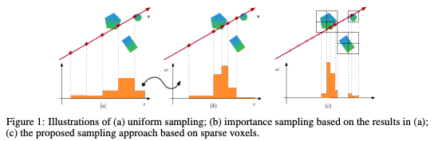

## NeRF: Representing Scenes as Neural Radiance Fields for View Synthesis
#### Ben Mildenhall, Pratul P. Srinivasan, Matthew Tancik, Jonathan T. Barron, Ravi Ramamoorthi, Ren Ng
###### 19 Mar 2020 (v1)

**Abstract**:
We present a method that achieves state-of-the-art results for synthesizing novel views of complex scenes by optimizing an underlying continuous volumetric scene function using a sparse set of input views. Our algorithm represents a scene using a fully-connected (non-convolutional) deep network, whose input is a single continuous 5D coordinate (spatial location (x,y,z) and viewing direction (θ,ϕ)) and whose output is the volume density and view-dependent emitted radiance at that spatial location. We synthesize views by querying 5D coordinates along camera rays and use classic volume rendering techniques to project the output colors and densities into an image. Because volume rendering is naturally differentiable, the only input required to optimize our representation is a set of images with known camera poses. We describe how to effectively optimize neural radiance fields to render photorealistic novel views of scenes with complicated geometry and appearance, and demonstrate results that outperform prior work on neural rendering and view synthesis. View synthesis results are best viewed as videos, so we urge readers to view our supplementary video for convincing comparisons.

**Summary**:

The paper "NeRF: Representing Scenes as Neural Radiance Fields for View Synthesis" proposes a method for synthesizing novel views of complex scenes by representing them as a continuous volumetric scene function optimized using a sparse set of input views, achieving state-of-the-art results for view synthesis and outperforming prior work on neural rendering and view synthesis.

**Key insights and lessons learned**:
* Representing a scene as a continuous volumetric function using a fully-connected deep network can achieve photorealistic results for view synthesis.
* The proposed method, called NeRF, uses volume rendering techniques to project the output colors and densities into an image, making the optimization process differentiable and requiring only a set of images with known camera poses as input.
* NeRF can handle scenes with complicated geometry and appearance, including those with non-Lambertian surfaces and complex lighting conditions.
* The method can be extended to handle dynamic scenes by introducing time as an additional input dimension to the network.
* NeRF has potential applications in virtual and augmented reality, as well as in generating data for training autonomous vehicles.

**Questions for the authors**:
* How does the performance of NeRF vary with the number and distribution of input views?
* How does the method handle occlusions and reflections in scenes?
* Can NeRF be extended to handle scenes with moving objects?
* How does the computation time of NeRF compare to other state-of-the-art methods for view synthesis?
* What are some potential limitations of the NeRF method, and how can they be addressed?

**Suggestions for future research**:
* Investigating the use of NeRF for other applications, such as generating realistic training data for robotic manipulation tasks or creating interactive virtual environments.
* Exploring the use of NeRF for generating novel views of scenes captured by non-traditional cameras, such as 360-degree cameras or light field cameras.
* Extending the method to handle other types of scenes, such as underwater scenes or scenes with extreme weather conditions.
* Developing techniques for optimizing NeRF using fewer input views or with noisy camera poses.
* Investigating ways to incorporate temporal coherence in the generated views for dynamic scenes.

---

## NeRF in the Wild: Neural Radiance Fields for Unconstrained Photo Collections
#### Ricardo Martin-Brualla, Noha Radwan, Mehdi S. M. Sajjadi, Jonathan T. Barron, Alexey Dosovitskiy, Daniel Duckworth
###### 5 Aug 2020 (v1)

**Abstract**:
We present a learning-based method for synthesizing novel views of complex scenes using only unstructured collections of in-the-wild photographs. We build on Neural Radiance Fields (NeRF), which uses the weights of a multilayer perceptron to model the density and color of a scene as a function of 3D coordinates. While NeRF works well on images of static subjects captured under controlled settings, it is incapable of modeling many ubiquitous, real-world phenomena in uncontrolled images, such as variable illumination or transient occluders. We introduce a series of extensions to NeRF to address these issues, thereby enabling accurate reconstructions from unstructured image collections taken from the internet. We apply our system, dubbed NeRF-W, to internet photo collections of famous landmarks, and demonstrate temporally consistent novel view renderings that are significantly closer to photorealism than the prior state of the art.

**Summary**:

The paper "NeRF in the Wild: Neural Radiance Fields for Unconstrained Photo Collections" introduces NeRF-W, a learning-based method that enables accurate reconstruction of complex scenes from unstructured collections of in-the-wild photographs, by extending the Neural Radiance Fields (NeRF) method to address issues related to variable illumination and transient occluders, and demonstrates its effectiveness on internet photo collections of famous landmarks, resulting in novel view renderings that are significantly closer to photorealism than the prior state of the art.

**Key insights and lessons learned from the paper include**:
* The NeRF method, which models the density and color of a scene as a function of 3D coordinates using a multilayer perceptron, works well on images of static subjects captured under controlled settings, but is incapable of modeling many real-world phenomena in uncontrolled images, such as variable illumination or transient occluders.
* The NeRF-W method extends NeRF to address these issues by incorporating additional information about lighting and visibility into the neural network, and using a differentiable renderer to optimize the network's weights.
* NeRF-W can be applied to internet photo collections of famous landmarks to synthesize novel views that are significantly closer to photorealism than the prior state of the art.
* NeRF-W can be further improved by using higher-quality input images, more advanced image processing techniques, and more sophisticated neural network architectures.

**Three questions that could be asked to the authors about their work are**:
* How does the differentiable renderer used in NeRF-W work, and what advantages does it offer over other rendering techniques?
* What kinds of scenes or phenomena are still challenging for NeRF-W to model accurately, and what are some potential avenues for future research in this area?
* How might the NeRF-W approach be extended to other applications or domains beyond synthesizing novel views of complex scenes from unstructured photo collections?

**Three suggestions for related topics or future research directions based on the content of the paper are**:
* Investigating ways to incorporate additional types of information into neural network models for 3D scene reconstruction, such as semantic segmentation, object recognition, or human pose estimation.
* Exploring how differentiable rendering techniques can be used to train neural networks for other computer vision tasks, such as image captioning or object tracking.
* Evaluating the effectiveness of NeRF-W on more diverse and challenging datasets, such as those with more complex lighting or camera motion, and developing new techniques to address the remaining limitations of the method.

---
## pixelNeRF: Neural Radiance Fields from One or Few Images
#### Alex Yu, Vickie Ye, Matthew Tancik, Angjoo Kanazawa
###### 3 Dec 2020 (v1)

  

**Abstract**:
We propose pixelNeRF, a learning framework that predicts a continuous neural scene representation conditioned on one or few input images. The existing approach for constructing neural radiance fields involves optimizing the representation to every scene independently, requiring many calibrated views and significant compute time. We take a step towards resolving these shortcomings by introducing an architecture that conditions a NeRF on image inputs in a fully convolutional manner. This allows the network to be trained across multiple scenes to learn a scene prior, enabling it to perform novel view synthesis in a feed-forward manner from a sparse set of views (as few as one). Leveraging the volume rendering approach of NeRF, our model can be trained directly from images with no explicit 3D supervision. We conduct extensive experiments on ShapeNet benchmarks for single image novel view synthesis tasks with held-out objects as well as entire unseen categories. We further demonstrate the flexibility of pixelNeRF by demonstrating it on multi-object ShapeNet scenes and real scenes from the DTU dataset. In all cases, pixelNeRF outperforms current state-of-the-art baselines for novel view synthesis and single image 3D reconstruction. For the video and code, please visit the project website: this https URL

**Summary**:

Title: "pixelNeRF: Neural Radiance Fields from One or Few Images" proposes a fully convolutional neural network architecture, pixelNeRF, for predicting a continuous neural scene representation conditioned on one or few input images, which enables novel view synthesis in a feed-forward manner from a sparse set of views and outperforms current state-of-the-art baselines for novel view synthesis and single image 3D reconstruction in various experiments on ShapeNet and DTU datasets.

**Key insights and lessons learned**:
* Existing approaches for constructing neural radiance fields require many calibrated views and significant compute time for each scene.
* The proposed architecture, pixelNeRF, conditions a NeRF on image inputs in a fully convolutional manner and can be trained across multiple scenes to learn a scene prior, enabling it to perform novel view synthesis in a feed-forward manner from a sparse set of views (as few as one).
* Leveraging the volume rendering approach of NeRF, pixelNeRF can be trained directly from images with no explicit 3D supervision.
* pixelNeRF outperforms current state-of-the-art baselines for novel view synthesis and single image 3D reconstruction in various experiments on ShapeNet and DTU datasets.

**Questions for the authors**:
* How did you come up with the idea of using a fully convolutional neural network architecture for neural radiance fields?
* What were some of the main challenges you encountered while developing the pixelNeRF architecture and how did you address them?
* In what ways do you see the pixelNeRF architecture being applied in practical applications beyond those tested in the paper?
* Can you discuss some of the limitations of the proposed approach and potential future directions for addressing them?
* How does the performance of pixelNeRF compare to other state-of-the-art methods for 3D scene reconstruction and novel view synthesis that use explicit 3D supervision?

**Suggestions for future research**:
* Investigating the use of pixelNeRF for other applications, such as object tracking or semantic segmentation.
* Exploring ways to further improve the efficiency and scalability of the pixelNeRF architecture for large-scale scene reconstruction.
* Investigating the use of other types of neural network architectures for 3D scene reconstruction and novel view synthesis, such as graph neural networks or transformers.
* Examining the impact of different training datasets and data augmentation techniques on the performance of the pixelNeRF architecture.
* Developing approaches for incorporating prior knowledge or constraints into the neural scene representation to improve the quality and consistency of the reconstructed scenes.

---

## Neural Sparse Voxel Fields
#### Lingjie Liu, Jiatao Gu, Kyaw Zaw Lin, Tat-Seng Chua, Christian Theobalt
###### 22 Jul 2020 (v1)

  

**Abstract**:
Photo-realistic free-viewpoint rendering of real-world scenes using classical computer graphics techniques is challenging, because it requires the difficult step of capturing detailed appearance and geometry models. Recent studies have demonstrated promising results by learning scene representations that implicitly encode both geometry and appearance without 3D supervision. However, existing approaches in practice often show blurry renderings caused by the limited network capacity or the difficulty in finding accurate intersections of camera rays with the scene geometry. Synthesizing high-resolution imagery from these representations often requires time-consuming optical ray marching. In this work, we introduce Neural Sparse Voxel Fields (NSVF), a new neural scene representation for fast and high-quality free-viewpoint rendering. NSVF defines a set of voxel-bounded implicit fields organized in a sparse voxel octree to model local properties in each cell. We progressively learn the underlying voxel structures with a differentiable ray-marching operation from only a set of posed RGB images. With the sparse voxel octree structure, rendering novel views can be accelerated by skipping the voxels containing no relevant scene content. Our method is typically over 10 times faster than the state-of-the-art (namely, NeRF(Mildenhall et al., 2020)) at inference time while achieving higher quality results. Furthermore, by utilizing an explicit sparse voxel representation, our method can easily be applied to scene editing and scene composition. We also demonstrate several challenging tasks, including multi-scene learning, free-viewpoint rendering of a moving human, and large-scale scene rendering. Code and data are available at our website: this https URL.

**Summary**:

The paper "Neural Sparse Voxel Fields" introduces a new neural scene representation, NSVF, for high-quality and fast free-viewpoint rendering, which defines a set of voxel-bounded implicit fields organized in a sparse voxel octree and is learned with a differentiable ray-marching operation from only posed RGB images.

**Key insights**:
* Existing approaches for free-viewpoint rendering often produce blurry renderings due to limited network capacity or difficulty in finding accurate intersections of camera rays with scene geometry, and are time-consuming.
* NSVF is a new neural scene representation that models local properties in each voxel cell, learns voxel structures with a differentiable ray-marching operation from posed RGB images, and accelerates rendering novel views by skipping irrelevant voxels.
* NSVF outperforms other state-of-the-art methods in terms of both rendering quality and efficiency, and enables high-quality free-viewpoint rendering on real-world scenes.

**Questions for the authors**:
* How does the NSVF representation handle variations in lighting and shadows across different views?
* Could NSVF be extended to handle dynamic scenes with moving objects?
* How does the training process for NSVF differ from other neural scene representations, and what are some potential challenges in training the model?
* Could NSVF be combined with other techniques for improved rendering, such as depth maps or normal maps?
* How might NSVF be applied in other domains, such as virtual reality or augmented reality?

**Suggestions for future research**:
* Investigating the use of NSVF for dynamic scenes with moving objects.
* Exploring ways to improve the efficiency of NSVF even further, such as through the use of hardware acceleration or parallel processing.
* Adapting NSVF for other applications, such as in robotics or autonomous vehicles.
* Studying the limitations of NSVF and potential failure cases, such as occlusions or reflections.
* Combining NSVF with other neural rendering techniques to create more advanced and powerful rendering models.

---

## Instant Neural Graphics Primitives with a Multiresolution Hash Encoding
#### Thomas Müller, Alex Evans, Christoph Schied, Alexander Keller
###### 16 Jan 2022 (v1)

  

**Abstract**:
Neural graphics primitives, parameterized by fully connected neural networks, can be costly to train and evaluate. We reduce this cost with a versatile new input encoding that permits the use of a smaller network without sacrificing quality, thus significantly reducing the number of floating point and memory access operations: a small neural network is augmented by a multiresolution hash table of trainable feature vectors whose values are optimized through stochastic gradient descent. The multiresolution structure allows the network to disambiguate hash collisions, making for a simple architecture that is trivial to parallelize on modern GPUs. We leverage this parallelism by implementing the whole system using fully-fused CUDA kernels with a focus on minimizing wasted bandwidth and compute operations. We achieve a combined speedup of several orders of magnitude, enabling training of high-quality neural graphics primitives in a matter of seconds, and rendering in tens of milliseconds at a resolution of 1920×1080.

**Summary**:

Summary: The paper proposes a new input encoding for neural graphics primitives, which allows for the use of a smaller network without compromising quality, thereby reducing computational and memory requirements, and presents a multiresolution hash table of trainable feature vectors, which are optimized using stochastic gradient descent, leading to significant speedups in both training and rendering.

**Key insights and lessons learned**:
* The proposed input encoding technique allows for the use of smaller neural networks in neural graphics primitives, leading to significant reductions in computational and memory requirements without compromising quality.
* The multiresolution hash table of trainable feature vectors provides a versatile and efficient means of optimizing the input encoding, allowing for parallelization of the architecture on modern GPUs.
* Fully-fused CUDA kernels are used to implement the proposed system, minimizing wasted bandwidth and compute operations, and achieving several orders of magnitude speedup.

**Questions**:
* What are the specific techniques used to minimize wasted bandwidth and compute operations in the fully-fused CUDA kernels?
* How does the multiresolution hash table technique compare to other encoding techniques in terms of computational efficiency and quality of results?
* Can the proposed technique be extended to other domains beyond neural graphics primitives?

**Future research directions**:
* Investigating the use of the proposed input encoding technique in other applications beyond neural graphics primitives, such as image recognition and natural language processing.
* Exploring the use of other optimization techniques in combination with the multiresolution hash table, such as genetic algorithms and particle swarm optimization.
* Developing new techniques for evaluating the quality of results obtained using the proposed input encoding and multiresolution hash table.

---
