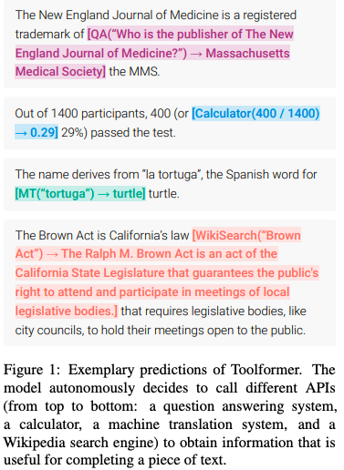

## Toolformer: Language Models Can Teach Themselves to Use Tools
#### Timo Schick, Jane Dwivedi-Yu, Roberto Dessì, Roberta Raileanu, Maria Lomeli, Luke Zettlemoyer, Nicola Cancedda, Thomas Scialom
###### 9 Feb 2023

  

**Abstract**:
Language models (LMs) exhibit remarkable abilities to solve new tasks from just a few examples or textual instructions, especially at scale. They also, paradoxically, struggle with basic functionality, such as arithmetic or factual lookup, where much simpler and smaller models excel. In this paper, we show that LMs can teach themselves to use external tools via simple APIs and achieve the best of both worlds. We introduce Toolformer, a model trained to decide which APIs to call, when to call them, what arguments to pass, and how to best incorporate the results into future token prediction. This is done in a self-supervised way, requiring nothing more than a handful of demonstrations for each API. We incorporate a range of tools, including a calculator, a Q\&A system, two different search engines, a translation system, and a calendar. Toolformer achieves substantially improved zero-shot performance across a variety of downstream tasks, often competitive with much larger models, without sacrificing its core language modeling abilities.

**Summary**:

The paper titled "Toolformer: Language Models Can Teach Themselves to Use Tools" introduces Toolformer, a language model trained to use external tools via simple APIs in a self-supervised way, requiring only a few demonstrations for each API. Toolformer achieves improved zero-shot performance across various tasks, often competitive with larger models, without sacrificing its core language modeling abilities.

**Key Insights and Lessons Learned**:
* Toolformer demonstrates that language models can teach themselves to use external tools, such as a calculator or translation system, through simple APIs.
* Toolformer achieves improved performance on various tasks through the use of external tools, without sacrificing its core language modeling abilities.
* Toolformer shows the potential for language models to better solve complex tasks through the integration of external tools.

**Questions for the authors**:
* How does Toolformer decide which APIs to call and when to call them?
* Can Toolformer be trained on other external tools in addition to the ones used in the paper?
* How does the performance of Toolformer compare with other language models that incorporate external tools?
* What limitations exist in terms of the number of external tools that Toolformer can use?
* Can Toolformer be used to teach itself to use multiple APIs for the same tool?

**Future Research Directions**:
* The integration of Toolformer with other language models to improve performance on more complex tasks.
* The use of Toolformer for other tasks, such as dialogue systems or question-answering systems.
* The comparison of Toolformer with other models that use external tools, such as reinforcement learning-based models.
* The exploration of the use of Toolformer in other domains, such as computer vision or robotics.
* The use of Toolformer for multi-modal learning, combining language and other forms of input.

---
