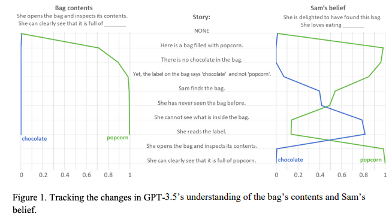
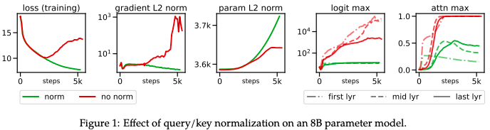

## Toolformer: Language Models Can Teach Themselves to Use Tools
#### Timo Schick, Jane Dwivedi-Yu, Roberto Dessì, Roberta Raileanu, Maria Lomeli, Luke Zettlemoyer, Nicola Cancedda, Thomas Scialom
###### 9 Feb 2023

  

**Abstract**:
Language models (LMs) exhibit remarkable abilities to solve new tasks from just a few examples or textual instructions, especially at scale. They also, paradoxically, struggle with basic functionality, such as arithmetic or factual lookup, where much simpler and smaller models excel. In this paper, we show that LMs can teach themselves to use external tools via simple APIs and achieve the best of both worlds. We introduce Toolformer, a model trained to decide which APIs to call, when to call them, what arguments to pass, and how to best incorporate the results into future token prediction. This is done in a self-supervised way, requiring nothing more than a handful of demonstrations for each API. We incorporate a range of tools, including a calculator, a Q\&A system, two different search engines, a translation system, and a calendar. Toolformer achieves substantially improved zero-shot performance across a variety of downstream tasks, often competitive with much larger models, without sacrificing its core language modeling abilities.

**Summary**:

The paper titled "Toolformer: Language Models Can Teach Themselves to Use Tools" introduces Toolformer, a language model trained to use external tools via simple APIs in a self-supervised way, requiring only a few demonstrations for each API. Toolformer achieves improved zero-shot performance across various tasks, often competitive with larger models, without sacrificing its core language modeling abilities.

**Key Insights and Lessons Learned**:
* Toolformer demonstrates that language models can teach themselves to use external tools, such as a calculator or translation system, through simple APIs.
* Toolformer achieves improved performance on various tasks through the use of external tools, without sacrificing its core language modeling abilities.
* Toolformer shows the potential for language models to better solve complex tasks through the integration of external tools.

**Questions for the authors**:
* How does Toolformer decide which APIs to call and when to call them?
* Can Toolformer be trained on other external tools in addition to the ones used in the paper?
* How does the performance of Toolformer compare with other language models that incorporate external tools?
* What limitations exist in terms of the number of external tools that Toolformer can use?
* Can Toolformer be used to teach itself to use multiple APIs for the same tool?

**Future Research Directions**:
* The integration of Toolformer with other language models to improve performance on more complex tasks.
* The use of Toolformer for other tasks, such as dialogue systems or question-answering systems.
* The comparison of Toolformer with other models that use external tools, such as reinforcement learning-based models.
* The exploration of the use of Toolformer in other domains, such as computer vision or robotics.
* The use of Toolformer for multi-modal learning, combining language and other forms of input.

---
## Theory of Mind May Have Spontaneously Emerged in Large Language Models
#### Michal Kosinski
###### 4 Feb 2023 (v1)

  

**Abstract**:
Theory of mind (ToM), or the ability to impute unobservable mental states to others, is central to human social interactions, communication, empathy, self-consciousness, and morality. We administer classic false-belief tasks, widely used to test ToM in humans, to several language models, without any examples or pre-training. Our results show that models published before 2022 show virtually no ability to solve ToM tasks. Yet, the January 2022 version of GPT-3 (davinci-002) solved 70% of ToM tasks, a performance comparable with that of seven-year-old children. Moreover, its November 2022 version (davinci-003), solved 93% of ToM tasks, a performance comparable with that of nine-year-old children. These findings suggest that ToM-like ability (thus far considered to be uniquely human) may have spontaneously emerged as a byproduct of language models' improving language skills.

**Summary**:

The authors of the paper "Theory of Mind May Have Spontaneously Emerged in Large Language Models" found that advanced language models, such as GPT-3, have developed a capacity for Theory of Mind (ToM), the ability to infer mental states of others, which was previously considered unique to humans. The models were tested with classic false-belief tasks, and the results showed that the latest version of GPT-3, davinci-003, solved 93% of the ToM tasks, a performance comparable with that of nine-year-old children.

**Key insights and lessons learned**:
* Large language models have developed a capacity for ToM.
* ToM abilities have emerged as a byproduct of language models' improving language skills.
* Advanced language models have performance comparable with that of children in ToM tasks.

**Questions for the authors**:
* Have you tested the ToM abilities of other large language models, such as BERT or XLNet?
* What implications do these findings have for the future development of AI systems with social abilities?
* Could you expand on the limitations of the study and what additional research needs to be done to further understand the ToM abilities of language models?
* What is the next step in this research area, and what are your plans for future studies?

**Suggestions for future research directions**:
* Further investigation of the limitations of language models' ToM abilities.
* Development of AI systems with advanced social abilities, such as empathy.
* Comparison of the ToM abilities of language models with other AI systems, such as reinforcement learning agents.
* Investigation of the ethical and societal implications of AI systems with social abilities.
* Study of the role of language models in shaping our understanding of human cognition and social behavior.

---

## Scaling Vision Transformers to 22 Billion Parameters
#### Mostafa Dehghani, Josip Djolonga, Basil Mustafa, Piotr Padlewski, Jonathan Heek, Justin Gilmer, Andreas Steiner, Mathilde Caron, Robert Geirhos, Ibrahim Alabdulmohsin, Rodolphe Jenatton, Lucas Beyer, Michael Tschannen, Anurag Arnab, Xiao Wang, Carlos Riquelme, Matthias Minderer, Joan Puigcerver, Utku Evci, Manoj Kumar, Sjoerd van Steenkiste, Gamaleldin F. Elsayed, Aravindh Mahendran, Fisher Yu, Avital Oliver, Fantine Huot, Jasmijn Bastings, Mark Patrick Collier, Alexey Gritsenko, Vighnesh Birodkar, Cristina Vasconcelos, Yi Tay, Thomas Mensink, Alexander Kolesnikov, Filip Pavetić, Dustin Tran, Thomas Kipf, Mario Lučić, Xiaohua Zhai, Daniel Keysers, Jeremiah Harmsen, Neil Houlsby
###### 10 Feb 2023

  

**Abstract**:
The scaling of Transformers has driven breakthrough capabilities for language models. At present, the largest large language models (LLMs) contain upwards of 100B parameters. Vision Transformers (ViT) have introduced the same architecture to image and video modelling, but these have not yet been successfully scaled to nearly the same degree; the largest dense ViT contains 4B parameters (Chen et al., 2022). We present a recipe for highly efficient and stable training of a 22B-parameter ViT (ViT-22B) and perform a wide variety of experiments on the resulting model. When evaluated on downstream tasks (often with a lightweight linear model on frozen features), ViT-22B demonstrates increasing performance with scale. We further observe other interesting benefits of scale, including an improved tradeoff between fairness and performance, state-of-the-art alignment to human visual perception in terms of shape/texture bias, and improved robustness. ViT-22B demonstrates the potential for "LLM-like" scaling in vision, and provides key steps towards getting there.

**Summary**:

The paper describes the training of a 22B-parameter Vision Transformer (ViT-22B) and evaluates its performance on various image and video recognition tasks.

**Key insights and lessons learned from the paper**:
* The authors have successfully trained a highly efficient and stable ViT-22B model.
* The ViT-22B demonstrates significant improvement in performance on several image and video recognition tasks when compared to its 4B-parameter counterpart.
* The authors provide a recipe for efficient and stable training of large Vision Transformers.

**Questions for the authors**:
* How did you overcome the challenges of training such a large model?
* Can you provide more insights into the recipe for efficient and stable training of large Vision Transformers?
* Can the same architecture be applied to other types of data, such as audio or speech?
* How does the ViT-22B perform in comparison to state-of-the-art computer vision models?
* Can the ViT-22B be used for other tasks, such as segmentation or generation?

**Suggestions for future research**:
* Exploration of the ViT-22B's performance on other types of data, such as audio or speech.
* Investigation of the ViT-22B's performance on tasks such as segmentation or generation.
* Comparison of the ViT-22B with state-of-the-art computer vision models on various tasks.
* Study of the ViT-22B's performance on smaller devices or in real-time settings.
* Development of a ViT-22B with reduced complexity for more efficient deployment.

---

