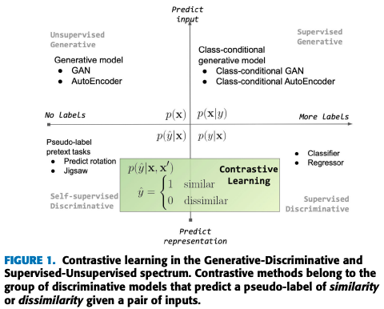
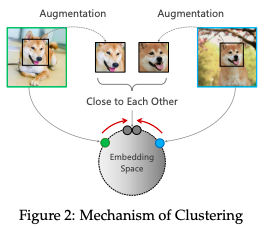
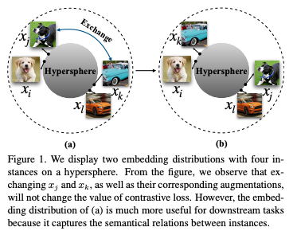
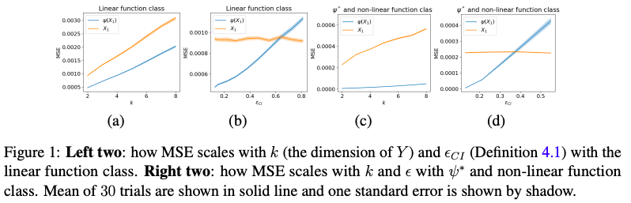
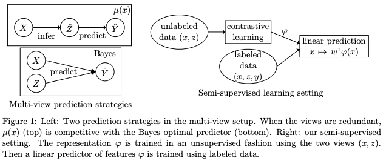
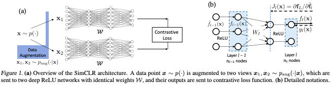
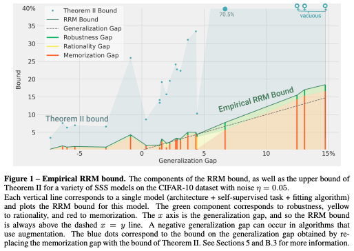

## Contrastive Representation Learning: A Framework and Review
#### Phuc H. Le-Khac, Graham Healy, Alan F. Smeaton
###### 10 Oct 2020 (v1)

  

**Abstract**:
Contrastive Learning has recently received interest due to its success in self-supervised representation learning in the computer vision domain. However, the origins of Contrastive Learning date as far back as the 1990s and its development has spanned across many fields and domains including Metric Learning and natural language processing. In this paper we provide a comprehensive literature review and we propose a general Contrastive Representation Learning framework that simplifies and unifies many different contrastive learning methods. We also provide a taxonomy for each of the components of contrastive learning in order to summarise it and distinguish it from other forms of machine learning. We then discuss the inductive biases which are present in any contrastive learning system and we analyse our framework under different views from various sub-fields of Machine Learning. Examples of how contrastive learning has been applied in computer vision, natural language processing, audio processing, and others, as well as in Reinforcement Learning are also presented. Finally, we discuss the challenges and some of the most promising future research directions ahead.

**Summary**:

The paper provides a comprehensive literature review of Contrastive Representation Learning (CRL), a self-supervised learning approach in various domains including computer vision and natural language processing, and proposes a general framework for CRL that unifies different contrastive learning methods. Key insights and lessons learned from the paper include the definition and components of CRL, the inductive biases present in any CRL system, and the applications and challenges of CRL in various domains.

**Questions for the authors**:
* Can you elaborate on the inductive biases present in CRL systems and how they affect the representations learned?
* What are some of the limitations of the proposed CRL framework and how can they be addressed?
* Can you discuss how the performance of CRL compares to other self-supervised learning approaches in terms of representation quality and transferability?
* How can CRL be extended to more complex data structures such as graph data or time-series data?
* What are the potential ethical considerations for the use of CRL in real-world applications?

**Suggested future research directions**:
* Investigation of CRL in new domains, such as medical imaging or speech recognition.
* Comparison of CRL with supervised learning approaches on benchmark datasets and tasks.
* Development of new contrastive learning methods for challenging data distributions, such as imbalanced or multi-modal data.
* Study of the generalization properties of CRL and the impact of data variability on representation quality.
* Exploration of the interpretability of representations learned by CRL and the development of methods for post-hoc analysis.

---

## Towards the Generalization of Contrastive Self-Supervised Learning
#### Weiran Huang, Mingyang Yi, Xuyang Zhao
###### 1 Nov 2021 (v1)

  

**Abstract**:
Recently, self-supervised learning has attracted great attention, since it only requires unlabeled data for training. Contrastive learning is one popular method for self-supervised learning and has achieved promising empirical performance. However, the theoretical understanding of its generalization ability is still limited. To this end, we define a kind of (σ,δ)-measure to mathematically quantify the data augmentation, and then provide an upper bound of the downstream classification error based on the measure. We show that the generalization ability of contrastive self-supervised learning depends on three key factors: alignment of positive samples, divergence of class centers, and concentration of augmented data. The first two factors can be optimized by contrastive algorithms, while the third one is priorly determined by pre-defined data augmentation. With the above theoretical findings, we further study two canonical contrastive losses, InfoNCE and cross-correlation loss, and prove that both of them are indeed able to satisfy the first two factors. Moreover, we empirically verify the third factor by conducting various experiments on the real-world dataset, and show that our theoretical inferences on the relationship between the data augmentation and the generalization of contrastive self-supervised learning agree with the empirical observations.

**Summary**:

The paper provides a theoretical analysis of the generalization ability of contrastive self-supervised learning, a popular method in self-supervised learning. The authors define a measure to quantify the data augmentation and show that the generalization ability of contrastive self-supervised learning depends on the alignment of positive samples, divergence of class centers, and concentration of augmented data. They also study two canonical contrastive losses, InfoNCE and cross-correlation loss, and prove that they can satisfy the first two factors. The paper concludes with empirical verification of the third factor through experiments on real-world datasets.

**Key insights and lessons learned**:
* The generalization ability of contrastive self-supervised learning depends on three key factors: alignment of positive samples, divergence of class centers, and concentration of augmented data.
* Two canonical contrastive losses, InfoNCE and cross-correlation loss, can satisfy the first two factors for good generalization ability.
* The concentration of augmented data is a priorly determined factor and its influence on the generalization ability can be verified through experiments on real-world datasets.

**Questions for the authors**:
* Could you explain in more detail how the $(\sigma,\delta)$-measure quantifies the data augmentation in contrastive self-supervised learning?
* How does the concentration of augmented data affect the generalization ability of contrastive self-supervised learning and in what ways can it be optimized?
* Can you provide examples of other pre-defined data augmentations and how they might impact the generalization ability of contrastive self-supervised learning?

**Suggested future research directions**:
* Extension of the analysis to other self-supervised learning methods beyond contrastive learning.
* Study of the generalization ability of contrastive self-supervised learning for different tasks and domains.
* Exploration of the impact of hyperparameters, such as the number of negative samples, on the generalization ability of contrastive self-supervised learning.
* Investigation of the generalization ability of contrastive self-supervised learning under domain shift or distribution shift.

---

## Understanding the Behaviour of Contrastive Loss
#### Feng Wang, Huaping Liu
###### 15 Dec 2020 (v1)

  

**Abstract**:
Unsupervised contrastive learning has achieved outstanding success, while the mechanism of contrastive loss has been less studied. In this paper, we concentrate on the understanding of the behaviours of unsupervised contrastive loss. We will show that the contrastive loss is a hardness-aware loss function, and the temperature {\tau} controls the strength of penalties on hard negative samples. The previous study has shown that uniformity is a key property of contrastive learning. We build relations between the uniformity and the temperature {\tau} . We will show that uniformity helps the contrastive learning to learn separable features, however excessive pursuit to the uniformity makes the contrastive loss not tolerant to semantically similar samples, which may break the underlying semantic structure and be harmful to the formation of features useful for downstream tasks. This is caused by the inherent defect of the instance discrimination objective. Specifically, instance discrimination objective tries to push all different instances apart, ignoring the underlying relations between samples. Pushing semantically consistent samples apart has no positive effect for acquiring a prior informative to general downstream tasks. A well-designed contrastive loss should have some extents of tolerance to the closeness of semantically similar samples. Therefore, we find that the contrastive loss meets a uniformity-tolerance dilemma, and a good choice of temperature can compromise these two properties properly to both learn separable features and tolerant to semantically similar samples, improving the feature qualities and the downstream performances.

**Summary**:

The paper by authors Feng Wang and Huaping Liu aims to understand the behavior of unsupervised contrastive loss in machine learning, showing that it is a hardness-aware loss function controlled by temperature, and that uniformity helps to learn separable features but excessive pursuit to uniformity can harm the formation of useful features.

**Key insights and lessons learned**:
* The contrastive loss is a hardness-aware loss function.
* The temperature controls the strength of penalties on hard negative samples.
* Uniformity helps to learn separable features, but excessive pursuit to uniformity can break the underlying semantic structure.
* The instance discrimination objective tries to push all different instances apart, ignoring underlying relations between samples.

**Questions for the authors**:
* Can you provide more insight into the concept of hardness in the context of contrastive loss?
* How does the choice of temperature affect the performance of contrastive learning?
* Can you provide examples of situations where excessive pursuit to uniformity might break the underlying semantic structure?
* How can the instance discrimination objective be improved to better preserve the underlying semantic structure?

**Suggestions for related topics or future research directions**:
* The application of contrastive loss to other domains, such as computer vision or natural language processing.
* Further exploration of the relationship between uniformity and the temperature in contrastive loss.
* The development of new loss functions that better preserve the underlying semantic structure.
* Comparison of contrastive loss with other unsupervised learning methods, such as generative adversarial networks.

---

## Predicting What You Already Know Helps: Provable Self-Supervised Learning
#### Jason D. Lee, Qi Lei, Nikunj Saunshi, Jiacheng Zhuo
###### 3 Aug 2020 (v1)

  

**Abstract**:
Self-supervised representation learning solves auxiliary prediction tasks (known as pretext tasks) without requiring labeled data to learn useful semantic representations. These pretext tasks are created solely using the input features, such as predicting a missing image patch, recovering the color channels of an image from context, or predicting missing words in text; yet predicting this \textit{known} information helps in learning representations effective for downstream prediction tasks. We posit a mechanism exploiting the statistical connections between certain {\em reconstruction-based} pretext tasks that guarantee to learn a good representation. Formally, we quantify how the approximate independence between the components of the pretext task (conditional on the label and latent variables) allows us to learn representations that can solve the downstream task by just training a linear layer on top of the learned representation. We prove the linear layer yields small approximation error even for complex ground truth function class and will drastically reduce labeled sample complexity. Next, we show a simple modification of our method leads to nonlinear CCA, analogous to the popular SimSiam algorithm, and show similar guarantees for nonlinear CCA.

**Summary**:

The paper by Lee, Lei, Saunshi, and Zhuo presents a self-supervised representation learning approach that learns useful semantic representations by solving auxiliary prediction tasks (pretext tasks) without requiring labeled data. The authors posit that predicting known information in the input features through reconstruction-based pretext tasks can lead to effective representations for downstream prediction tasks. They provide formal proofs to support their claims and show that their method can achieve small approximation errors even for complex ground truth functions and reduce labeled sample complexity. Additionally, they show that a simple modification of their method leads to nonlinear CCA, similar to the SimSiam algorithm.

**Key Insights and Lessons Learned**:
* Predicting known information in the input features can lead to effective representations for downstream prediction tasks.
* Reconstruction-based pretext tasks can guarantee to learn a good representation.
* The approximate independence between the components of the pretext task allows for a linear layer to yield small approximation error.
* Nonlinear CCA can be achieved through a simple modification of the proposed method.

**Questions for the Authors**:
* Can this approach be applied to other forms of data, such as audio or text?
* Have you tested the performance of this approach on other downstream prediction tasks?
* Can you provide more insight into the conditions under which the approximation error is small?
* What is the impact of the number of components used in the pretext task on the results?
* How does this approach compare to other self-supervised representation learning methods?

**Suggestions for Related Topics or Future Research Directions**:
* Extension of the approach to other forms of data such as audio or text.
* Comparison of the proposed method with other self-supervised representation learning methods.
* Investigation of the impact of the number of components used in the pretext task on the results.
* Application of the proposed method to other downstream prediction tasks.
* Further exploration of the conditions under which the approximation error is small.

---

## Contrastive learning, multi-view redundancy, and linear models
#### Christopher Tosh, Akshay Krishnamurthy, Daniel Hsu
###### 24 Aug 2020 (v1)

  

**Abstract**:
Self-supervised learning is an empirically successful approach to unsupervised learning based on creating artificial supervised learning problems. A popular self-supervised approach to representation learning is contrastive learning, which leverages naturally occurring pairs of similar and dissimilar data points, or multiple views of the same data. This work provides a theoretical analysis of contrastive learning in the multi-view setting, where two views of each datum are available. The main result is that linear functions of the learned representations are nearly optimal on downstream prediction tasks whenever the two views provide redundant information about the label.

**Summary**:

The paper "Contrastive learning, multi-view redundancy, and linear models" by Christopher Tosh, Akshay Krishnamurthy, and Daniel Hsu provides a theoretical analysis of contrastive learning in the multi-view setting, where two views of each datum are available. The main result is that linear functions of the learned representations are nearly optimal on downstream prediction tasks whenever the two views provide redundant information about the label.

**Key insights and lessons learned**:
* The authors provide a theoretical analysis of contrastive learning in the multi-view setting, which can help understand the success of this approach in representation learning.
* They demonstrate that linear functions of the learned representations are nearly optimal on downstream prediction tasks when the two views of the data provide redundant information about the label.
* The results suggest that contrastive learning can lead to representations that are well-suited for linear models.

**Questions for the authors**:
* Can you explain the intuition behind the results that linear functions of the learned representations are nearly optimal on downstream prediction tasks?
* How does the performance of linear models change when the two views of the data do not provide redundant information about the label?
* Can you provide an example of a real-world scenario where multi-view redundancy is present?
* How would the results change if non-linear models were used instead of linear models?
* Can you provide some insights on the scalability of the method to larger datasets?

**Future research directions**:
* The authors could explore the use of non-linear models in the context of their results.
* The impact of the number of views on the performance of the method could be studied further.
* The generalizability of the results to other types of datasets and tasks could be evaluated.
* The authors could extend the analysis to deep neural network models.
* A comparison of the method with other self-supervised learning approaches could be performed.

---

## Understanding Self-supervised Learning with Dual Deep Networks
#### Yuandong Tian, Lantao Yu, Xinlei Chen, Surya Ganguli
###### 1 Oct 2020 (v1)

  

**Abstract**:
We propose a novel theoretical framework to understand contrastive self-supervised learning (SSL) methods that employ dual pairs of deep ReLU networks (e.g., SimCLR). First, we prove that in each SGD update of SimCLR with various loss functions, including simple contrastive loss, soft Triplet loss and InfoNCE loss, the weights at each layer are updated by a \emph{covariance operator} that specifically amplifies initial random selectivities that vary across data samples but survive averages over data augmentations. To further study what role the covariance operator plays and which features are learned in such a process, we model data generation and augmentation processes through a \emph{hierarchical latent tree model} (HLTM) and prove that the hidden neurons of deep ReLU networks can learn the latent variables in HLTM, despite the fact that the network receives \emph{no direct supervision} from these unobserved latent variables. This leads to a provable emergence of hierarchical features through the amplification of initially random selectivities through contrastive SSL. Extensive numerical studies justify our theoretical findings. Code is released in this https URL.

**Summary**:

The paper presents a novel theoretical framework to understand contrastive self-supervised learning methods that use dual deep ReLU networks. The authors prove that in each SGD update of these methods, the weights at each layer are updated by a covariance operator that amplifies initial random selectivities, and that the hidden neurons of deep ReLU networks can learn the latent variables in a hierarchical latent tree model through contrastive SSL, leading to the emergence of hierarchical features.

**Key Insights**:
* The authors provide a theoretical understanding of the self-supervised learning methods that employ dual deep ReLU networks.
* The authors show that the covariance operator updates the weights at each layer by amplifying initial random selectivities that vary across data samples but survive averages over data augmentations.
* The authors prove that the hidden neurons of deep ReLU networks can learn latent variables through contrastive SSL, leading to the emergence of hierarchical features.

**Questions for the authors**:
* How does the hierarchical latent tree model (HLTM) relate to other generative models such as Variational Autoencoders (VAEs)?
* How does the performance of the proposed framework compare to other self-supervised learning methods?
* How does the number of augmentations affect the performance of the framework?
* Can the proposed framework be extended to other types of deep neural networks besides ReLU networks?
* What is the scalability of the proposed framework for large-scale datasets?

**Future Research Directions**:
* Extension of the proposed framework to other modalities such as images, audio, and text.
* Incorporation of the proposed framework with supervised learning methods for improved performance.
* Investigation of the robustness of the proposed framework to adversarial examples.
* Exploration of the relationship between the proposed framework and other self-supervised learning methods, such as Generative Adversarial Networks (GANs) and Autoregressive Models.
* Study of the interpretability of the features learned by the proposed framework.

---

## For self-supervised learning, Rationality implies generalization, provably
#### Yamini Bansal, Gal Kaplun, Boaz Barak
###### 16 Oct 2020

  

**Abstract**:
We prove a new upper bound on the generalization gap of classifiers that are obtained by first using self-supervision to learn a representation r of the training data, and then fitting a simple (e.g., linear) classifier g to the labels. Specifically, we show that (under the assumptions described below) the generalization gap of such classifiers tends to zero if 𝖢(g)≪n, where 𝖢(g) is an appropriately-defined measure of the simple classifier g's complexity, and n is the number of training samples. We stress that our bound is independent of the complexity of the representation r. We do not make any structural or conditional-independence assumptions on the representation-learning task, which can use the same training dataset that is later used for classification. Rather, we assume that the training procedure satisfies certain natural noise-robustness (adding small amount of label noise causes small degradation in performance) and rationality (getting the wrong label is not better than getting no label at all) conditions that widely hold across many standard architectures. We show that our bound is non-vacuous for many popular representation-learning based classifiers on CIFAR-10 and ImageNet, including SimCLR, AMDIM and MoCo.

**Summary**:

The authors of the paper have proven a new upper bound on the generalization gap of classifiers obtained through self-supervised learning. They show that the generalization gap tends to zero if the complexity of the simple classifier used is much smaller than the number of training samples, assuming the training procedure satisfies noise-robustness and rationality conditions. The bound applies to popular representation-learning based classifiers and has been shown to be non-vacuous for SimCLR, AMDIM, and MoCo on CIFAR-10 and ImageNet.

**Key insights and lessons learned**:
* The generalization gap of classifiers obtained through self-supervised learning can be bounded.
* The generalization gap tends to zero if the complexity of the simple classifier is much smaller than the number of training samples.
* The bound applies to popular representation-learning based classifiers and has been shown to be non-vacuous for SimCLR, AMDIM, and MoCo on CIFAR-10 and ImageNet.

**Questions for the authors**:
* Can you explain the noise-robustness and rationality conditions in more detail?
* How do your results compare with existing bounds on the generalization gap of classifiers?
* Can you provide more details on the measure of the simple classifier's complexity $\mathsf{C}(g)$?
* Can you discuss any limitations or limitations of the results presented in the paper?
* Can you explain the significance of your results for the field of self-supervised learning?

**Suggestions for related topics or future research directions**:
* Further exploration of the implications of the noise-robustness and rationality conditions for self-supervised learning.
* Comparison of the generalization gap bounds obtained in this paper with other bounds in the literature.
* Investigation of the robustness of the results to different types of noise and to different architectures.
* Extension of the results to more complex classifiers, such as deep neural networks.
* Study of the trade-off between the complexity of the simple classifier and the generalization gap.

---

