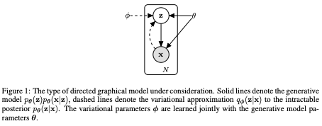

## Importance Weighted Autoencoders
#### Yuri Burda, Roger Grosse, Ruslan Salakhutdinov
###### 7 Nov 2016 

**Abstract**:
The variational autoencoder (VAE; Kingma, Welling (2014)) is a recently proposed generative model pairing a top-down generative network with a bottom-up recognition network which approximates posterior inference. It typically makes strong assumptions about posterior inference, for instance that the posterior distribution is approximately factorial, and that its parameters can be approximated with nonlinear regression from the observations. As we show empirically, the VAE objective can lead to overly simplified representations which fail to use the network's entire modeling capacity. We present the importance weighted autoencoder (IWAE), a generative model with the same architecture as the VAE, but which uses a strictly tighter log-likelihood lower bound derived from importance weighting. In the IWAE, the recognition network uses multiple samples to approximate the posterior, giving it increased flexibility to model complex posteriors which do not fit the VAE modeling assumptions. We show empirically that IWAEs learn richer latent space representations than VAEs, leading to improved test log-likelihood on density estimation benchmarks.

**Summary**:
The paper introduces the Importance Weighted Autoencoder (IWAE), which is a generative model with the same architecture as a Variational Autoencoder (VAE), but with a tighter log-likelihood lower bound derived from importance weighting. The IWAE allows for increased flexibility in approximating the posterior distribution and leads to a richer latent space representation, leading to improved results on density estimation benchmarks.

**Key Insights and Lessons Learned**:

* The VAE objective can lead to overly simplified representations and fail to use the entire modeling capacity.
* The IWAE uses multiple samples to approximate the posterior, leading to increased flexibility in modeling complex posteriors.
* The IWAE learns richer latent space representations and results in improved test log-likelihood on density estimation benchmarks.

**Questions for the Authors**:

* Can you explain the limitations of VAEs that led you to propose IWAEs as an alternative?
* How do the results of IWAEs compare to other generative models in terms of both computational efficiency and accuracy?
* How would the results change if the IWAE architecture were applied to different types of data or tasks?
* Can you discuss any potential implications of the IWAE for real-world applications in areas such as computer vision or natural language processing?
* Have you considered using IWAEs in combination with other generative models or techniques, and if so, what kind of results have you seen?

**Future Research Directions**:

* Applying IWAEs to different types of data, such as images or text, to see if the improved latent space representation leads to improved performance on downstream tasks.
* Investigating the impact of different hyperparameters, such as the number of importance samples, on the performance of IWAEs.
* Exploring the use of IWAEs in combination with other generative models or techniques.
* Evaluating the scalability of IWAEs on large-scale datasets.
* Investigating the potential for using IWAEs for unsupervised representation learning.

--- 

## Auto-Encoding Variational Bayes
#### Diederik P Kingma, Max Welling
###### 20 Dec 2013

  

**Abstract**:

How can we perform efficient inference and learning in directed probabilistic models, in the presence of continuous latent variables with intractable posterior distributions, and large datasets? We introduce a stochastic variational inference and learning algorithm that scales to large datasets and, under some mild differentiability conditions, even works in the intractable case. Our contributions are two-fold. First, we show that a reparameterization of the variational lower bound yields a lower bound estimator that can be straightforwardly optimized using standard stochastic gradient methods. Second, we show that for i.i.d. datasets with continuous latent variables per datapoint, posterior inference can be made especially efficient by fitting an approximate inference model (also called a recognition model) to the intractable posterior using the proposed lower bound estimator. Theoretical advantages are reflected in experimental results.

**Summary**:

The paper "Auto-Encoding Variational Bayes" introduces a stochastic variational inference and learning algorithm for directed probabilistic models with continuous latent variables and intractable posterior distributions. The authors provide a reparameterization of the variational lower bound and show how to fit an approximate inference model to the intractable posterior.

**Key Insights and Lessons Learned**:

* A reparameterization of the variational lower bound can be optimized using standard stochastic gradient methods.
* Fitting an approximate inference model to the intractable posterior can make posterior inference more efficient.
* The authors show theoretical and experimental results to support their proposed method.

**Questions for the authors**:

* Can you provide further explanation of the conditions under which the proposed method will work in the intractable case?
* How does this method compare to other existing methods in terms of computational efficiency and accuracy?
* Have you considered any extensions of this method to handle non-i.i.d datasets?
* How does this method handle high dimensional continuous latent variables?
Can you discuss any limitations or limitations of the method?

**Future research directions**:

* Application of the proposed method to other types of probabilistic models.
* Extension of the method to handle non-continuous latent variables.
* Comparison of the method to other Bayesian deep learning methods.
* Investigation of how to handle cases where the intractable posterior distributions are not i.i.d.
* Exploration of how to handle high dimensional continuous latent variables. 

--- 
