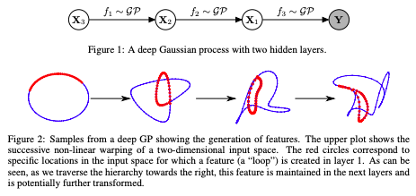
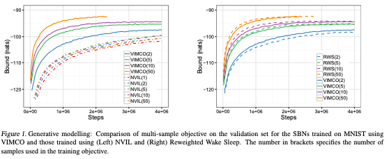
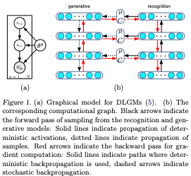
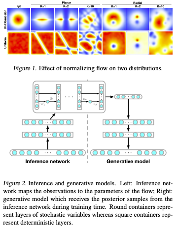
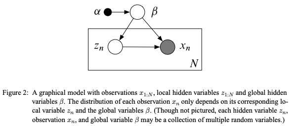
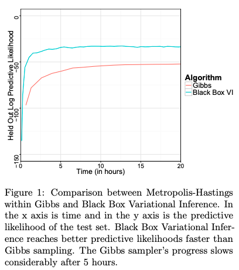

## Importance Weighted Autoencoders
#### Yuri Burda, Roger Grosse, Ruslan Salakhutdinov
###### 1 Sep 2015

**Abstract**:
The variational autoencoder (VAE; Kingma, Welling (2014)) is a recently proposed generative model pairing a top-down generative network with a bottom-up recognition network which approximates posterior inference. It typically makes strong assumptions about posterior inference, for instance that the posterior distribution is approximately factorial, and that its parameters can be approximated with nonlinear regression from the observations. As we show empirically, the VAE objective can lead to overly simplified representations which fail to use the network's entire modeling capacity. We present the importance weighted autoencoder (IWAE), a generative model with the same architecture as the VAE, but which uses a strictly tighter log-likelihood lower bound derived from importance weighting. In the IWAE, the recognition network uses multiple samples to approximate the posterior, giving it increased flexibility to model complex posteriors which do not fit the VAE modeling assumptions. We show empirically that IWAEs learn richer latent space representations than VAEs, leading to improved test log-likelihood on density estimation benchmarks.

**Summary**:
The paper introduces the Importance Weighted Autoencoder (IWAE), which is a generative model with the same architecture as a Variational Autoencoder (VAE), but with a tighter log-likelihood lower bound derived from importance weighting. The IWAE allows for increased flexibility in approximating the posterior distribution and leads to a richer latent space representation, leading to improved results on density estimation benchmarks.

**Key Insights and Lessons Learned**:

* The VAE objective can lead to overly simplified representations and fail to use the entire modeling capacity.
* The IWAE uses multiple samples to approximate the posterior, leading to increased flexibility in modeling complex posteriors.
* The IWAE learns richer latent space representations and results in improved test log-likelihood on density estimation benchmarks.

**Questions for the Authors**:

* Can you explain the limitations of VAEs that led you to propose IWAEs as an alternative?
* How do the results of IWAEs compare to other generative models in terms of both computational efficiency and accuracy?
* How would the results change if the IWAE architecture were applied to different types of data or tasks?
* Can you discuss any potential implications of the IWAE for real-world applications in areas such as computer vision or natural language processing?
* Have you considered using IWAEs in combination with other generative models or techniques, and if so, what kind of results have you seen?

**Future Research Directions**:

* Applying IWAEs to different types of data, such as images or text, to see if the improved latent space representation leads to improved performance on downstream tasks.
* Investigating the impact of different hyperparameters, such as the number of importance samples, on the performance of IWAEs.
* Exploring the use of IWAEs in combination with other generative models or techniques.
* Evaluating the scalability of IWAEs on large-scale datasets.
* Investigating the potential for using IWAEs for unsupervised representation learning.

--- 

## Auto-Encoding Variational Bayes
#### Diederik P Kingma, Max Welling
###### 20 Dec 2013

  

**Abstract**:

How can we perform efficient inference and learning in directed probabilistic models, in the presence of continuous latent variables with intractable posterior distributions, and large datasets? We introduce a stochastic variational inference and learning algorithm that scales to large datasets and, under some mild differentiability conditions, even works in the intractable case. Our contributions are two-fold. First, we show that a reparameterization of the variational lower bound yields a lower bound estimator that can be straightforwardly optimized using standard stochastic gradient methods. Second, we show that for i.i.d. datasets with continuous latent variables per datapoint, posterior inference can be made especially efficient by fitting an approximate inference model (also called a recognition model) to the intractable posterior using the proposed lower bound estimator. Theoretical advantages are reflected in experimental results.

**Summary**:

The paper "Auto-Encoding Variational Bayes" introduces a stochastic variational inference and learning algorithm for directed probabilistic models with continuous latent variables and intractable posterior distributions. The authors provide a reparameterization of the variational lower bound and show how to fit an approximate inference model to the intractable posterior.

**Key Insights and Lessons Learned**:

* A reparameterization of the variational lower bound can be optimized using standard stochastic gradient methods.
* Fitting an approximate inference model to the intractable posterior can make posterior inference more efficient.
* The authors show theoretical and experimental results to support their proposed method.

**Questions for the authors**:

* Can you provide further explanation of the conditions under which the proposed method will work in the intractable case?
* How does this method compare to other existing methods in terms of computational efficiency and accuracy?
* Have you considered any extensions of this method to handle non-i.i.d datasets?
* How does this method handle high dimensional continuous latent variables?
Can you discuss any limitations or limitations of the method?

**Future research directions**:

* Application of the proposed method to other types of probabilistic models.
* Extension of the method to handle non-continuous latent variables.
* Comparison of the method to other Bayesian deep learning methods.
* Investigation of how to handle cases where the intractable posterior distributions are not i.i.d.
* Exploration of how to handle high dimensional continuous latent variables. 

--- 

## Variational Auto-encoded Deep Gaussian Processes
#### Zhenwen Dai, Andreas Damianou, Javier González, Neil Lawrence
###### 19 Nov 2015

  

**Abstract**:

We develop a scalable deep non-parametric generative model by augmenting deep Gaussian processes with a recognition model. Inference is performed in a novel scalable variational framework where the variational posterior distributions are reparametrized through a multilayer perceptron. The key aspect of this reformulation is that it prevents the proliferation of variational parameters which otherwise grow linearly in proportion to the sample size. We derive a new formulation of the variational lower bound that allows us to distribute most of the computation in a way that enables to handle datasets of the size of mainstream deep learning tasks. We show the efficacy of the method on a variety of challenges including deep unsupervised learning and deep Bayesian optimization

**Summary**:

The paper "Variational Auto-encoded Deep Gaussian Processes" by Zhenwen Dai, Andreas Damianou, Javier González, and Neil Lawrence introduces a scalable deep non-parametric generative model that combines deep Gaussian processes with a recognition model. Inference is performed in a scalable variational framework, where the variational posterior distributions are reparameterized through a multilayer perceptron, resulting in a new formulation of the variational lower bound. The method is demonstrated to be effective in various deep unsupervised learning and deep Bayesian optimization tasks.

**Key Insights and Lessons**:

* A scalable deep non-parametric generative model is introduced.
* Inference is performed in a scalable variational framework.
* The variational posterior distributions are reparameterized through a multilayer perceptron.
* A new formulation of the variational lower bound is derived.
* The method is demonstrated to be effective in deep unsupervised learning and deep Bayesian optimization tasks.

**Questions for the authors**:

* How does the new formulation of the variational lower bound compare to existing methods in terms of computational efficiency?
* What is the scalability of the method compared to other deep generative models?
* Can you discuss the limitations of the method and how they can be addressed in future work?
* How does the method handle multi-modal data distributions?
* How does the performance of the method compare to other deep generative models in terms of sample quality?

**Future Research Directions**:

* Extension of the method to handle multi-modal data distributions.
* Comparison of the method with other deep generative models in terms of sample quality.
* Investigation of the scalability of the method compared to other deep generative models.
* Exploration of the limitations of the method and how they can be addressed in future work.
* Application of the method in various fields, such as computer vision and speech recognition

--- 

## Neural Variational Inference and Learning in Belief Networks
#### Andriy Mnih, Karol Gregor
###### 31 Jan 2014

**Abstract**:

Highly expressive directed latent variable models, such as sigmoid belief networks, are difficult to train on large datasets because exact inference in them is intractable and none of the approximate inference methods that have been applied to them scale well. We propose a fast non-iterative approximate inference method that uses a feedforward network to implement efficient exact sampling from the variational posterior. The model and this inference network are trained jointly by maximizing a variational lower bound on the log-likelihood. Although the naive estimator of the inference model gradient is too high-variance to be useful, we make it practical by applying several straightforward model-independent variance reduction techniques. Applying our approach to training sigmoid belief networks and deep autoregressive networks, we show that it outperforms the wake-sleep algorithm on MNIST and achieves state-of-the-art results on the Reuters RCV1 document dataset.

**Summary**:

The paper "Neural Variational Inference and Learning in Belief Networks" by Andriy Mnih and Karol Gregor proposes a fast non-iterative approximate inference method for highly expressive directed latent variable models, such as sigmoid belief networks. The method uses a feedforward network to implement efficient exact sampling from the variational posterior and the model and inference network are trained jointly. The authors show that the proposed method outperforms the wake-sleep algorithm on MNIST and achieves state-of-the-art results on the Reuters RCV1 document dataset.

**Key Insights and Lessons Learned**:

* Exact inference in highly expressive directed latent variable models is intractable and existing approximate methods do not scale well.
* A feedforward network can be used to implement efficient exact sampling from the variational posterior.
* The model and inference network can be trained jointly by maximizing a variational lower bound on the log-likelihood.
* Variance reduction techniques can make the naive estimator of the inference model gradient practical.
* The proposed method outperforms the wake-sleep algorithm on MNIST and achieves state-of-the-art results on the Reuters RCV1 document dataset.

**Questions for the authors**:

* How does the proposed method compare to other variational inference methods?
* Can the method be extended to handle models with more complex structure?
* How sensitive is the performance of the method to the choice of variance reduction techniques?
* How does the method handle missing data?
* Have the results been verified on other datasets?

**Related Topics/Future Research Directions**:

* Extension of the method to handle models with more complex structure.
* Comparison with other variational inference methods.
* Application of the method to other domains, such as natural language processing.
* Exploration of other variance reduction techniques.
* Extension of the method to handle missing data.

--- 

## Variational inference for Monte Carlo objectives
#### Andriy Mnih, Danilo J. Rezende
###### 22 Feb 2016

  

**Abstract**:

Recent progress in deep latent variable models has largely been driven by the development of flexible and scalable variational inference methods. Variational training of this type involves maximizing a lower bound on the log-likelihood, using samples from the variational posterior to compute the required gradients. Recently, Burda et al. (2016) have derived a tighter lower bound using a multi-sample importance sampling estimate of the likelihood and showed that optimizing it yields models that use more of their capacity and achieve higher likelihoods. This development showed the importance of such multi-sample objectives and explained the success of several related approaches.
We extend the multi-sample approach to discrete latent variables and analyze the difficulty encountered when estimating the gradients involved. We then develop the first unbiased gradient estimator designed for importance-sampled objectives and evaluate it at training generative and structured output prediction models. The resulting estimator, which is based on low-variance per-sample learning signals, is both simpler and more effective than the NVIL estimator proposed for the single-sample variational objective, and is competitive with the currently used biased estimators.

**Summary**:

The paper presents a new method for variational training of deep latent variable models using a multi-sample importance sampling estimate of the likelihood. The authors derive a tight lower bound and develop an unbiased gradient estimator based on low-variance per-sample learning signals. They evaluate this estimator on generative and structured output prediction models and show that it is both simple and effective, competitive with currently used biased estimators.

**Key insights and lessons learned from the paper**:
* Variational training of deep latent variable models involves maximizing a lower bound on the log-likelihood
* The use of multi-sample objectives can lead to models that use more of their capacity and achieve higher likelihoods
* The authors develop a new unbiased gradient estimator designed for importance-sampled objectives

**Questions to ask the authors**:
* What motivated the development of a new gradient estimator specifically for importance-sampled objectives?
* Can the method be extended to other types of deep latent variable models besides generative and structured output prediction models?
* How does the performance of the proposed estimator compare with other existing methods on large-scale datasets?
* How does the proposed method deal with issues such as high variance in the importance weights?
* Can the method be used in other areas besides deep latent variable models, such as reinforcement learning or Bayesian neural networks?

**Suggestions for related topics or future research directions**:
* Extension of the method to handle non-Gaussian variational posteriors and likelihoods
* Applications of the method in reinforcement learning and Bayesian neural networks
* Analysis of the scalability of the method to large datasets
* Exploration of different strategies for choosing importance sampling distributions
* Comparison of the method with other gradient-based variational inference methods, such as the score function estimator.

--- 

## Stochastic Backpropagation and Approximate Inference in Deep Generative Models
#### Danilo Jimenez Rezende, Shakir Mohamed, Daan Wierstra
###### 16 Jan 2014

  

**Abstract**:
We marry ideas from deep neural networks and approximate Bayesian inference to derive a generalised class of deep, directed generative models, endowed with a new algorithm for scalable inference and learning. Our algorithm introduces a recognition model to represent approximate posterior distributions, and that acts as a stochastic encoder of the data. We develop stochastic back-propagation -- rules for back-propagation through stochastic variables -- and use this to develop an algorithm that allows for joint optimisation of the parameters of both the generative and recognition model. We demonstrate on several real-world data sets that the model generates realistic samples, provides accurate imputations of missing data and is a useful tool for high-dimensional data visualisation.

**Summary**: 

The paper "Stochastic Backpropagation and Approximate Inference in Deep Generative Models" presents a class of deep, directed generative models that combine ideas from deep neural networks and approximate Bayesian inference. The authors develop a new algorithm for scalable inference and learning that uses a recognition model to represent approximate posterior distributions and acts as a stochastic encoder of the data.

**Key insights and lessons learned from the paper include**:
* The use of a recognition model to represent approximate posterior distributions allows for the joint optimization of the parameters of both the generative and recognition models.
* The authors introduce a new algorithm for scalable inference and learning called stochastic backpropagation.
* The models generated by the algorithm can generate realistic samples, provide accurate imputations of missing data, and are useful tools for high-dimensional data visualization.

**Questions for the authors**:
* Can you elaborate on the relationship between the recognition model and the generative model?
* How does the algorithm handle overfitting in the models?
* Can you discuss the limitations and potential drawbacks of using stochastic backpropagation in deep generative models?

**Suggestions for related topics or future research directions**:
* Further exploration of the relationship between deep neural networks and approximate Bayesian inference.
* Investigating the application of stochastic backpropagation in other types of machine learning models.
* Exploring the use of the algorithm for other tasks beyond data imputation and visualization, such as prediction and classification.

--- 

## Variational Inference with Normalizing Flows
#### Danilo Jimenez Rezende, Shakir Mohamed
###### 21 May 2015

  

**Abstract**: 

The choice of approximate posterior distribution is one of the core problems in variational inference. Most applications of variational inference employ simple families of posterior approximations in order to allow for efficient inference, focusing on mean-field or other simple structured approximations. This restriction has a significant impact on the quality of inferences made using variational methods. We introduce a new approach for specifying flexible, arbitrarily complex and scalable approximate posterior distributions. Our approximations are distributions constructed through a normalizing flow, whereby a simple initial density is transformed into a more complex one by applying a sequence of invertible transformations until a desired level of complexity is attained. We use this view of normalizing flows to develop categories of finite and infinitesimal flows and provide a unified view of approaches for constructing rich posterior approximations. We demonstrate that the theoretical advantages of having posteriors that better match the true posterior, combined with the scalability of amortized variational approaches, provides a clear improvement in performance and applicability of variational inference.

**Summary**:

The paper presents a new approach to variational inference by introducing normalizing flows as a method for specifying flexible and complex approximate posterior distributions. It provides a unified view of finite and infinitesimal flows and demonstrates how these flows can result in improved performance and applicability of variational inference.

**Key Insights**:
* Variational inference is an important method in machine learning, but its effectiveness is limited by the choice of approximate posterior distribution
* Normalizing flows provide a flexible and scalable approach to specifying complex approximate posterior distributions
* Using normalizing flows in variational inference results in improved performance and applicability

**Questions for the authors**:
* Can you explain the concept of normalizing flows in more detail for readers who are not familiar with the topic?
* Can you provide examples of other applications of normalizing flows beyond variational inference?
* How does the use of normalizing flows compare to other methods for specifying approximate posterior distributions in terms of computational complexity and scalability?
* Can you discuss any limitations or potential drawbacks of using normalizing flows in variational inference?
* How do normalizing flows perform in comparison to other methods on real-world datasets and tasks?

**Suggestions for related topics or future research directions**:
* Applying normalizing flows to other areas of machine learning and deep learning
* Developing new and more efficient algorithms for training normalizing flows
* Investigating the use of normalizing flows for probabilistic programming and probabilistic modeling
* Examining the connections between normalizing flows and other generative models such as Generative Adversarial Networks (GANs)
* Comparing the performance of normalizing flows with other flexible posterior approximations such as deep Gaussian processes.

--- 

## Stochastic Variational Inference
#### Matt Hoffman, David M. Blei, Chong Wang, John Paisley
###### 29 Jun 2012

  

**Abstract**: 

We develop stochastic variational inference, a scalable algorithm for approximating posterior distributions. We develop this technique for a large class of probabilistic models and we demonstrate it with two probabilistic topic models, latent Dirichlet allocation and the hierarchical Dirichlet process topic model. Using stochastic variational inference, we analyze several large collections of documents: 300K articles from Nature, 1.8M articles from The New York Times, and 3.8M articles from Wikipedia. Stochastic inference can easily handle data sets of this size and outperforms traditional variational inference, which can only handle a smaller subset. (We also show that the Bayesian nonparametric topic model outperforms its parametric counterpart.) Stochastic variational inference lets us apply complex Bayesian models to massive data sets.

**Summary**:

The paper titled "Stochastic Variational Inference" by Matt Hoffman, David M. Blei, Chong Wang, and John Paisley presents a scalable algorithm for approximating posterior distributions in Bayesian models. The authors demonstrate the technique using two probabilistic topic models, latent Dirichlet allocation, and the hierarchical Dirichlet process topic model, and show that it outperforms traditional variational inference, especially when dealing with large data sets.

**Key insights and lessons learned**:
* Stochastic variational inference is a scalable algorithm for approximating posterior distributions.
* The method can be applied to a wide range of probabilistic models.
* Stochastic variational inference is shown to outperform traditional variational inference when dealing with large data sets.
* The Bayesian nonparametric topic model is demonstrated to be more effective than its parametric counterpart.

**Questions to ask the authors**:
* What challenges did you encounter when developing stochastic variational inference and how did you overcome them?
* How would you extend the method to more complex models, such as deep generative models?
* What is the computational time and memory cost of using stochastic variational inference, and how does it compare to traditional variational inference?
* What impact do you think stochastic variational inference will have on the field of Bayesian modeling and machine learning?
* Can you provide an example of a real-world application where stochastic variational inference has been applied and what were the results?

**Future research directions**:
* Further investigation of the method's scalability and its performance on even larger data sets.
* Extension of the method to non-probabilistic models, such as deep neural networks.
* Combining stochastic variational inference with other Bayesian inference methods, such as MCMC.
* Investigation of the method's performance when dealing with non-linear models.
* Study of the potential for combining stochastic variational inference with other machine learning techniques, such as reinforcement learning or active learning.

--- 

## Black Box Variational Inference
#### Rajesh Ranganath, Sean Gerrish, David M. Blei
######  31 Dec 2013

  

**Abstract**: 

Variational inference has become a widely used method to approximate posteriors in complex latent variables models. However, deriving a variational inference algorithm generally requires significant model-specific analysis, and these efforts can hinder and deter us from quickly developing and exploring a variety of models for a problem at hand. In this paper, we present a "black box" variational inference algorithm, one that can be quickly applied to many models with little additional derivation. Our method is based on a stochastic optimization of the variational objective where the noisy gradient is computed from Monte Carlo samples from the variational distribution. We develop a number of methods to reduce the variance of the gradient, always maintaining the criterion that we want to avoid difficult model-based derivations. We evaluate our method against the corresponding black box sampling based methods. We find that our method reaches better predictive likelihoods much faster than sampling methods. Finally, we demonstrate that Black Box Variational Inference lets us easily explore a wide space of models by quickly constructing and evaluating several models of longitudinal healthcare data.

**Summary**:

The authors present a "black box" variational inference algorithm that can be applied to a variety of models with little additional derivation. The algorithm is based on stochastic optimization of the variational objective, using Monte Carlo samples to compute the noisy gradient. The authors evaluate their method against black box sampling methods and find that it reaches better predictive likelihoods faster. The method is demonstrated on longitudinal healthcare data.

**Key Insights and Lessons Learned**:
* The authors propose a "black box" variational inference algorithm that can be applied to a variety of models without significant model-specific analysis.
* The algorithm is based on stochastic optimization of the variational objective and reduces the variance of the gradient.
* The method is found to reach better predictive likelihoods faster than sampling-based methods.

**Questions for the authors**:
* How does the black box variational inference algorithm compare to other existing variational inference algorithms in terms of accuracy and computational efficiency?
* Can the method be extended to models with non-conjugate priors?
* How sensitive is the method to the choice of variational distributions?
* Can the method be applied to models with latent variables with different dimensions?
* What are some limitations of the method and how can they be addressed in future work?

**Future Research Directions**:
* Extension of the method to models with non-conjugate priors.
* Comparison with other existing variational inference algorithms.
* Application of the method to models with latent variables with different dimensions.
* Development of methods to address the limitations of the method.
* Exploration of the method in different domains such as computer vision and natural language processing.
